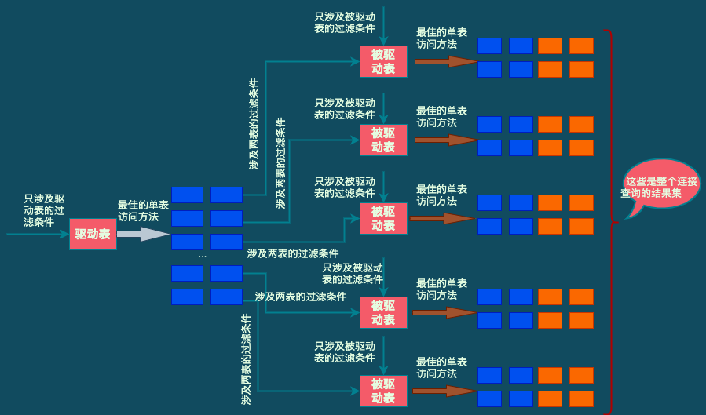

# 连接的原理

> **示例表: **
>
> ```mysql
> mysql> CREATE TABLE t1 (m1 int, n1 char(1));
> Query OK, 0 rows affected (0.03 sec)
> 
> mysql> CREATE TABLE t2 (m2 int, n2 char(1));
> Query OK, 0 rows affected (0.02 sec)
> 
> mysql> INSERT INTO t1 VALUES(1, 'a'), (2, 'b'), (3, 'c');
> Query OK, 3 rows affected (0.00 sec)
> Records: 3  Duplicates: 0  Warnings: 0
> 
> mysql> INSERT INTO t2 VALUES(2, 'b'), (3, 'c'), (4, 'd');
> Query OK, 3 rows affected (0.00 sec)
> Records: 3  Duplicates: 0  Warnings: 0
> 
> mysql> SELECT * FROM t1;
> +------+------+
> | m1   | n1   |
> +------+------+
> |    1 | a    |
> |    2 | b    |
> |    3 | c    |
> +------+------+
> 3 rows in set (0.01 sec)
> 
> mysql> SELECT * FROM t2;
> +------+------+
> | m2   | n2   |
> +------+------+
> |    2 | b    |
> |    3 | c    |
> |    4 | d    |
> +------+------+
> 3 rows in set (0.00 sec)
> ```
>
> 


## 1. 连接简介

### 1.1 连接的本质

> **从本质上来说，连接就是把各个表中的记录都取出来进行依次匹配，并把匹配后的组合发送给客户端。把t1 和 t2两个表连接起来的过程如下图: **
>
>  
>
> 
>
> > **如果连接查询的结果集中包含一个表中的每一条记录与另一个表中的每一条记录相互匹配的组合，那么这样的结果集就可称为 笛卡尔积。因为表t1和表t2中各有3条记录，所以这两个表连接之后的笛卡尔积就有 3*3 = 9 条记录。**

> **MySQL中，连接查询的语法也很随意，只要在FROM语句后边跟多个表名就好了，比如，把t1表和t2表连接起来的查询语句可以写成: **
>
> ```mysql
> mysql> SELECT * FROM t1, t2;
> +------+------+------+------+
> | m1   | n1   | m2   | n2   |
> +------+------+------+------+
> |    1 | a    |    2 | b    |
> |    2 | b    |    2 | b    |
> |    3 | c    |    2 | b    |
> |    1 | a    |    3 | c    |
> |    2 | b    |    3 | c    |
> |    3 | c    |    3 | c    |
> |    1 | a    |    4 | d    |
> |    2 | b    |    4 | d    |
> |    3 | c    |    4 | d    |
> +------+------+------+------+
> 9 rows in set (0.00 sec)
> ```
>
> 


### 1.2 连接过程简介

> **如果不附加任何限制条件，多个表连接起来产生的笛卡尔积可能是非常巨大的。比如，3个100行记录的表连接起来产生的笛卡尔积就有 100万条记录。所以在连接时过滤掉特定的记录组合是有必要的。**
>
> **在连接查询中的过滤条件可以分成下面两种: **
>
> + **涉及单表的条件，如 t1.m1 > 1、t2.n2<'d'等**
> + **涉及两表的条件，如 t1.m1 = t2.m2 、 t1.n1 > t2.n2 等**


**假设有如下的查询语句: **

```mysql
SELECT * FROM t1, t2 WHERE t1.m1 > 1 AND t1.m1 = t2.m2 AND t2.n2 < 'd';
```

**在这个查询中，指明了3个过滤条件:**

+ t1.m1 > 1
+ t1.m1 = t2.m2
+ t2.n2 < 'd'


**这个连接查询的执行过程大致如下: **

+ **步骤1: 首先确定上第一个需要查询的表，这个表称为`驱动表`**

  > **这里假设使用t1作为驱动表，那么就需要到t1表中查找满足 t1.m1 > 1 的记录。因为表中数据太少，也没在表上建立二级索引，所以查询t1表所用的访问方法是all，也就是采用全表扫描的方式执行单表查询，查询过程如下图: **
  >
  >  

+ **步骤2: 步骤1中从驱动表每获取到一条记录，都需要到t2表中查找匹配的记录**

  > **所谓匹配的记录，指的是符合过滤条件的记录。因为是根据t1表中的记录去找t2表中的记录，所以t2表也可以称为被驱动表。步骤1从驱动表中得到了2条记录，也就意味着需要查询2次t2表。此时涉及两个表的列的过滤条件 t1.m1 = t2.m2 可以使用了。**
  >
  > **从 t1表 中查询得到的第一条记录，也就是当 t1.m1 = 2 时， 过滤条件 t1.m1 = t2.m2 就相当于 t2.m2 = 2 。所以此时 t2表 相当于有了 t2.m2 = 2 、t2.n2<'d' 这两个过滤条件，然后到 t2表中执行单表查询。**
  >
  > **从 t1表 中查询得到的第二条记录，也就是当 t1.m1 = 3 时，过滤条件 t1.m1 = t2.m2 就相当于 t2.m2 = 3 。所以此时 t2表 相当于有了 t2.m2=3 、t2.n2<'d' 这两个过滤条件，然后到t2表中执行单表查询。**
  >
  > > **所以整个连接查询的执行过程如下图: **
  > >
  > >  


> ***`注: 从上面的两个步骤可以看出，t1表 和 t2表 的连接查询共需要查询1次t1表、2次t2表。当然这是特定过滤条件下的结果。如果把     "t1.m1 > 1" 这个条件去掉，那么从t1表中查出的记录就有3条，就需要查询3次t2表了。也就是说，在两表的连接查询中，驱动表只需要访问一次，被驱动表可能需要访问多次`***


### 1.3 内连接和外连接

> **示例表: **
>
> ```mysql
> mysql> CREATE TABLE student (
>     ->     number INT NOT NULL AUTO_INCREMENT COMMENT '学号',
>     ->     name VARCHAR(5) COMMENT '姓名',
>     ->     major VARCHAR(30) COMMENT '专业',
>     ->     PRIMARY KEY (number)
>     -> ) Engine=InnoDB CHARSET=utf8 COMMENT '学生信息表';
> Query OK, 0 rows affected (0.03 sec)
> 
> mysql> CREATE TABLE score (
>     ->     number INT COMMENT '学号',
>     ->     subject VARCHAR(30) COMMENT '科目',
>     ->     score TINYINT COMMENT '成绩',
>     ->     PRIMARY KEY (number, subject)
>     -> ) Engine=InnoDB CHARSET=utf8 COMMENT '学生成绩表';
> Query OK, 0 rows affected (0.01 sec)
> 
> mysql> INSERT INTO student VALUES(20180101, '张三', '软件学院'), (20180102, '李四', '计算机科学与工程'), (20180103, '王五', '计算机科学与工程');
> Query OK, 3 rows affected (0.01 sec)
> Records: 3  Duplicates: 0  Warnings: 0
> 
> mysql> INSERT INTO score VALUES(20180101, 'MySQL是怎样运行的', 78), (20180101, '深入浅出MySQL', 88), (20180102, '深入浅出MySQL', 98), (20180102, 'MySQL是怎样运行的', 100);
> Query OK, 4 rows affected (0.01 sec)
> Records: 4  Duplicates: 0  Warnings: 0
> 
> mysql> SELECT * from student;
> +----------+--------+--------------------------+
> | number   | name   | major                    |
> +----------+--------+--------------------------+
> | 20180101 | 张三   | 软件学院                 |
> | 20180102 | 李四   | 计算机科学与工程         |
> | 20180103 | 王五   | 计算机科学与工程         |
> +----------+--------+--------------------------+
> 3 rows in set (0.00 sec)
> 
> mysql> SELECT * FROM score;
> +----------+-------------------------+-------+
> | number   | subject                 | score |
> +----------+-------------------------+-------+
> | 20180101 | MySQL是怎样运行的       |    78 |
> | 20180101 | 深入浅出MySQL           |    88 |
> | 20180102 | MySQL是怎样运行的       |   100 |
> | 20180102 | 深入浅出MySQL           |    98 |
> +----------+-------------------------+-------+
> 4 rows in set (0.00 sec)
> ```
>
> 

> **要想把学生的考试成绩都查询出来，就需要进行两表边境了。连接过程就是从student表中取出记录，然后在score表中查找number相同的成绩记录，所以过滤条件就是 student.number=score.number，则整个查询语句就是下面这样:**
>
> ```mysql
> mysql> SELECT * FROM student, score WHERE student.number = score.number;
> +----------+--------+--------------------------+----------+-------------------------+-------+
> | number   | name   | major                    | number   | subject                 | score |
> +----------+--------+--------------------------+----------+-------------------------+-------+
> | 20180101 | 张三   | 软件学院                 | 20180101 | MySQL是怎样运行的       |    78 |
> | 20180101 | 张三   | 软件学院                 | 20180101 | 深入浅出MySQL           |    88 |
> | 20180102 | 李四   | 计算机科学与工程         | 20180102 | MySQL是怎样运行的       |   100 |
> | 20180102 | 李四   | 计算机科学与工程         | 20180102 | 深入浅出MySQL           |    98 |
> +----------+--------+--------------------------+----------+-------------------------+-------+
> 4 rows in set (0.00 sec)
> 
> # 指定输出列
> mysql> SELECT s1.number, s1.name, s2.subject, s2.score FROM student AS s1, score AS s2 WHERE s1.number = s2.number;
> +----------+--------+-------------------------+-------+
> | number   | name   | subject                 | score |
> +----------+--------+-------------------------+-------+
> | 20180101 | 张三   | MySQL是怎样运行的       |    78 |
> | 20180101 | 张三   | 深入浅出MySQL           |    88 |
> | 20180102 | 李四   | MySQL是怎样运行的       |   100 |
> | 20180102 | 李四   | 深入浅出MySQL           |    98 |
> +----------+--------+-------------------------+-------+
> 4 rows in set (0.00 sec)
> ```


**从上述查询结果中可以看到，各个学生对应的各科成绩都被查出来了。`可是出现了一个问题: 王五同学因为某些原因没有参加考试，所以在score表中没有对应的成绩记录。`如果想查看包括缺考的所有学生的成绩，但是到目前为止介绍的连续查询无法完成这样的需求。**

**这个需求的本质是这样的: `针对驱动表中的某条记录，即使在被驱动表中没有找到与之匹配的记录，也仍然需要把该驱动表记录加入到结果集。`为了解决这个问题，就有了`内连接和外连接`的概念。**

+ **对于内连接的两个表，若驱动表中的记录在被驱动表中找不到匹配的记录，则该记录不会加入到最后的结果集。前面提到的连接都是内连接**

+ **对于外连接的两个表，即使驱动表中的记录在被驱动表中没有匹配的记录，也仍然需要加入到结果集**

  > **在MySQL中，根据选取的驱动表的不同，外连接可以细分为2种: **
  >
  > + **左外连接: 选取左侧的表为驱动表**
  > + **右外连接: 选取右侧的表为驱动表**


> ***但是对于外连接，仍然存在问题: `即使对于外连接，有时候我们也不想把驱动表的全部记录都加入到最后的结果集。`***
>
> ***`即有时候匹配失败要加入结果集，有时候又不要加入结果集。应该怎么办?? 此时就需要把过滤条件分为两种，即过滤条件在不同的地方是有不同的语义的。`***
>
> + **WHERE 子句中的过滤条件**
>
>   > **`WHERE 子句中的过滤条件就是我们平时见的那种。不论是内连接还是外连接，凡是不符合 WHERE 子句中过滤条件的记录都不会被加入到最后的结果集`**
>
> + **ON 子句中的过滤条件**
>
>   > **`对于外连接的驱动表中的记录来说，如果无法在被驱动表中找到匹配ON子句中过滤条件的记录，那么该驱动表记录仍然会被加入到结果集中，对应的被驱动表记录的各个字段使用NULL 值填充`**
>   >
>   > ***`需要注意的是，这个 ON子句 是专门为 "外连接驱动表中的记录在被驱动表找不到匹配记录时是否应该把该驱动表记录加入结果集中" 这个场景提出的。所以，如果把ON子句放到内连接中， MySQL会把它像 WHERE 子句一样对待。也就是说，内连接中的 WHERE 子句和 ON 子句是等价的。`***


#### 1.3.1 左（外）连接的语法

> **左（外）连接 简称为 左连接**

> **左（外）连接语法：假如要把 t1表 和 t2表 进行左外连接查询，可以像如下格式写：**
>
> ```mysql
> # 中括号里的 OUTER 是可以省略有
> SELECT * FROM t1 LEFT [OUTER] JOIN t2 ON 连接条件 [WHERE 普通过滤条件];
> ```
>
> > **示例: 把所有学生（即使是缺考的学生）的成绩信息都查询出来，并放到结果集中**
> >
> > ```mysql
> > mysql> SELECT s1.number, s1.name, s2.subject, s2.score FROM student AS s1 LEFT JOIN score AS s2 ON s1.number = s2.number;
> > +----------+--------+-------------------------+-------+
> > | number   | name   | subject                 | score |
> > +----------+--------+-------------------------+-------+
> > | 20180101 | 张三   | MySQL是怎样运行的       |    78 |
> > | 20180101 | 张三   | 深入浅出MySQL           |    88 |
> > | 20180102 | 李四   | MySQL是怎样运行的       |   100 |
> > | 20180102 | 李四   | 深入浅出MySQL           |    98 |
> > | 20180103 | 王五   | NULL                    |  NULL |
> > +----------+--------+-------------------------+-------+
> > 5 rows in set (0.00 sec)
> > ```


#### 1.3.2 右（外）连接的语法

> **与左（外）连接类似**
>
> ```mysql
> SELECT * FROM t1 RIGHT [OUTER] JOIN t2 ON 连接条件 [WHERE 普通过滤条件];
> ```
>
> > **在右（外）连接中，只不过驱动表是右边的表，被驱动表是左边的表**


#### 1.3.3 内连接的语法

> ***`内连接和外连接的根本区别就是在驱动表中的记录不符合 ON 子名中的连接条件时，内连接不会把该记录加入到最后的结果集中。`***
>
> **`前面提到了一种最简单的内连接语法，就是直接把需要连接的多个表都放到 FROM 子句后面。`**
>
> **`其实MySQL 针对内连接提供了好多不同的语法，以t1和t2表为例:`**
>
> ```mysql
> SELECT * FROM t1 [INNER | CROSS] JOIN t2 [ON 连接条件] [WHERE 普通过滤条件];
> ```
>
> > **也就是说在MySQL中，下面这几种内连接的写法都是等价的: **
> >
> > + **SELECT * FROM t1 JOIN t2; **
> > + **SELECT * FROM t1 INNER JOIN t2;**
> > + **SELECT * FROM t1 CROSS JOIN t2;**
> > + **SELECT * FROM t1, t2;**
>
> > ***`再次强调一次，由于在内连接中 ON子句 和 WHERE子句是等价的，所以内连接中不要求强制写明ON子句`***


#### 1.3.4 小结

> **将3种连接方式写在一起，方便理解**

```mysql
mysql> SELECT * FROM t1 INNER JOIN t2 ON t1.m1 = t2.m2;
+------+------+------+------+
| m1   | n1   | m2   | n2   |
+------+------+------+------+
|    2 | b    |    2 | b    |
|    3 | c    |    3 | c    |
+------+------+------+------+
2 rows in set (0.00 sec)

mysql> SELECT * FROM t1 LEFT JOIN t2 ON t1.m1 = t2.m2;
+------+------+------+------+
| m1   | n1   | m2   | n2   |
+------+------+------+------+
|    2 | b    |    2 | b    |
|    3 | c    |    3 | c    |
|    1 | a    | NULL | NULL |
+------+------+------+------+
3 rows in set (0.00 sec)

mysql> SELECT * FROM t1 RIGHT JOIN t2 ON t1.m1 = t2.m2;
+------+------+------+------+
| m1   | n1   | m2   | n2   |
+------+------+------+------+
|    2 | b    |    2 | b    |
|    3 | c    |    3 | c    |
| NULL | NULL |    4 | d    |
+------+------+------+------+
3 rows in set (0.00 sec)
```


## 2. 连接的原理

> **上面主要介绍了连接、内连接、外连接的概念，下面重点介绍 MySQL采用了什么样的算法来进行表与表之间的连接。了解这个之后，才能明白为啥有时连接查询的运行速度很快，但有时却特别慢。**


### 2.1 嵌套循环连接

> **前面说过，对于两表连接来说，驱动表只会被访问一遍，但被驱动表却要被访问好多遍：具体访问几遍取决于对驱动表执行ujge查询后的结果集中有多少条记录。**
>
> **`对于内连接来说，选取哪个表为驱动表都没关系；而外边拉的驱动表是固定的，也就是说左（外）连接的驱动表就是左边的那个表，右（外）连接的驱动表就是右边的那个表。`**
>
> **前面已经介绍过t1表 和 t2表执行内连接查询的大致过程如下: **
>
> + **步骤1: 选取驱动表，使用与驱动表相关的过滤条件，选取代价最低的单表访问方法来执行对驱动表的单表查询**
> + **步骤2: 对步骤1中查询驱动表得到的结果集中的每一条记录，都分别到被驱动表中查找匹配的记录**
> + **步骤3: 如果有3个表进行连接，那么步骤2中得到的结果集就像是新的驱动表，然后第3个表就成为了被驱动表，然后重复上面的过程。**

> **通用的两表连接过程如下图: **
>
>  

> **这个过程就像是一个嵌套的循环，所以这种"驱动表只访问一次，但被驱动表却可能访问多次，且访问次数取决于对驱动表执行单表查询后的结果集中有多少条记录" 的连接执行方式称为`嵌套循环连接`，这是最简单也是最笨拙的一种连接查询算法。**

> ***`注: 对于嵌套循环连接算法来说，每当我们从驱动表中得到了一条记录时，就根据这条记录立即到被驱动表中查询一次，如果得到了匹配的记录，就把组合后的记录发送给客户端，然后再到驱动表中获取下一条记录；这个过程将重复进行，上图中提到的"结果集"只是一个抽象的概念。不要错误地以为是把驱动表中所有的记录都先查出来放到某个地方，然后再遍历这些记录的。`***


### 2.2 使用索引加快连接速度

> **上面的嵌套循环连接算法中可能需要访问多次被驱动表。如果访问被驱动表的方式都是全表扫描，那得要扫描好多次。但是，查询t2表其实就相当于一次单表查询，那么就可以利用索引来加快查询速度。**
>
> **以前面介绍的t1和t2表进行内连接为例： **
>
> ```mysql
> SELECT * FROM t1, t2 WHERE t1.m1 > 1 AND t1.m1 = t2.m2 AND t2.n2 < 'd';
> ```
>
> > **这条语句的具体执行逻辑参考 第2节 步骤2 。**
> >
> > **它的查询执行过程要以总结为**
> >
> > + **1. 先以 t1.m1 > 1 条件查询表t1，会得到2条记录**
> >
> > + **2. 遍历循环从表t1中查询得到的2条记录，分别以每条记录的m1列值为条件到表t2中查询: **
> >
> >   + **当t1.m1 = 2 时，查询一遍t2表，对t2表的查询语句相当于:**
> >
> >     ```mysql
> >     SELECT * FROM t2 WHERE t2.m2 = 2 AND t2.n2 < 'd';
> >     ```
> >
> >   + **当 t1.m1=3时，查询一遍t2表，此时对t2表的查询语句相当于:**
> >
> >     ```mysql
> >     SELECT * FROM t2 WHERE t2.m2 = 3 AND t2.n2 < 'd';
> >     ```
> >
> >     
>
> 
>
> > **`可以看到，原来SQL语句中的 "t1.m1 = t2.m2" 这个涉及两个表的过滤条件在针对 t2表进行查询时，关于t1表的条件就已经确定了，所以此时只需要单单优化针对t2表的查询即可。`**
> >
> > > **上面两个对t2表的查询语句中利用到的是 m2 和 n2列，所以可以进行如下尝试: **
> > >
> > > + **在m2列上建立索引。因为针对m2列的条件是等值查找，比如t2.m2=2、t2.m2=3 等，所以可能使用到 ref访问方法。假设使用 ref访问方法来执行对t2表的查询，需要在lkge之后再判断 t2.n2<'d' 这个条件是否成立**
> > > + **在n2列上建立索引，涉及的条件是 t2.n2 < 'd'，可能用到 range访问方法。**
> > > + **如果 m2和n2列上都存在索引，那么就需要从这两个里面挑一个代价更低的索引来查询t2表**


### 2.3 基于块的嵌套循环连接

> **现实生活中的表可不像t1、t2表这样只有3条记录，可能有几百万条、几千万条记录。假设不能使用索引加快被驱动表的查询过程，所以对于驱动表结果集中的每一条记录，都需要对被驱动表执行全表扫描。这样在对被驱动表进行全表扫描时，可能表前面的记录还在内存中，而表后面的记录还在磁盘上。而等到扫描表中后面的记录时，有可能由于内在不足，需要把表前面的记录从内存中释放掉给现在正在扫描的记录腾地方。前面强调过，在采用嵌套循环连接算法的两表连接过程中，被驱动表可是要被访问好多次。如果这个被驱动表中的数据特别多而且不能使用索引进行访问，那就相当于要从椎间盘上读这个表好多次，这个I/O代价就非常大了。**
>
> **`通过上面的叙述可以了解到，驱动表结果集中有多少条记录，就可能把被驱动表从磁盘加载到内存中多少次。那么是否可以在把被驱动表中的记录加载到内存时，一次性地与驱动表中的多条记录进行匹配叱？？这样就可以大大减少重复从磁盘上加载被驱动表的代价了。`**
>
> **`所以MySQL中提出了一个名为 Join Buffer（连接缓冲区）的概念。Join Buffer就是在执行连接查询前申请的一块固定大小的内存。先把若干条驱动表结果集中的记录装在这个Join Buffer中，然后开始扫描被驱动表，每一条被驱动表的记录一次性与Join Buffer中的多条驱动表记录进行匹配。由于匹配过程都是在内存中完成的，所以这样可以显著减少被驱动表的I/O代价。`**
>
> > **`最好的情况是Join Buffer足够大，能容纳驱动表结果集中的所有记录，这样只需要访问一次被驱动表就可以完成连接操作了。`**
> >
> > **MySQL中把这种加入了Join Buffer的嵌套循环连接算法称为基于块的嵌套循环连接（Block Nested-Loop Join）算法**

> **Join Buffer的大小可以通过 join_buffer_size 选项进行设置，默认大小为 256KB**

