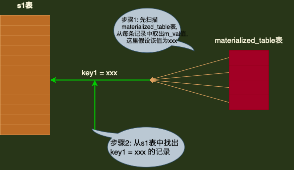

# 基于规则的优化

> **从本质上来说，MySQL其实就是一个软件，设计MySQL的人不能要求使用这个软件的人都是数据库高手。所以无法避免某些用户编写一些执行起来十分耗费性能的语句。即使这样，MySQL也还是依据一些规则，尽力地把这些糟糕的语句转换成某种可以高效执行的形式。这个过程可以称为`查询重写`**


## 1. 条件化简

### 1.1 移除不必要的括号

> ```mysql
> SELECT * FROM (t1, (t2, t3)) WHERE t1.a = t2.a AND t2.b = t3.b;
> ```

> **优化器会把不必要的括号去掉**
>
> ```mysql
> SELECT * FROM t1, t2, t3 WHERE t1.a = t2.a AND t2.b = t3.b;
> ```


### 1.2 常量传递

> **有时某个表达是某个列和某个常量的等值匹配，如：**
>
> ```mysql
> a = 5;
> ```
>
> > **当使用 `AND` 操作符将这个表达式和其它涉及列a 的表达式连接起来时，可以将其它表达式中a的值替换为5，如下面的sql:**
> >
> > ```mysql
> > a = 5 AND b > a;
> > ```
> >
> > **会转化为:**
> >
> > ```mysql
> > a = 5 AND b > 5;
> > ```


### 1.3 移除没用的条件

> **对于一些永远为TRUE或FALSE的表达式，优化器会将它们移除掉。如下SQL：**
>
> ```mysql
> (a < 1 AND b = b ) OR (a = 6 OR 5 != 5)
> ```
>
> > **明显，b = b 这个表达式永远为TRUE，5 ！= 5 永远为FALSE，所以简化后的表达式如下: **
> >
> > ```mysql
> > a < 1 OR a = 6;
> > ```


### 1.4 表达式计算

> **在执行查询前，如果表达式中只包含常量 的话，它的值会被先计算出来，如下SQL：**
>
> ```mysql
> a = 5 + 1
> ```
>
> > **会被简化成:**
> >
> > ```mysql
> > a = 6
> > ```
> >
> > > **注：**
> > >
> > > **如果某个列并不是以单独的列式作为表达式的操作数，比如出现在函数中，或者出现在某个更复杂的表达式中，如:**
> > >
> > > ```mysql
> > > ABS(a) > 5
> > > #或者
> > > -a < -8
> > > ```
> > >
> > > > **优化器并不会尝试对这些表达式进行化简的。**


### 1.5 HAVING 子名 和 WHERE 子句的合并

> **如果查询语句中没有出现诸如 SUM、MAX这样的聚集子涵数以及 GROUP BY 子句，查询优化器就把HAVING 子句和WHER 合并起来。**


### 1.6 常量表检测

> **MySQL中认为下面这两种类型的查询运行得很快: **
>
> + **类型1: 查询的表中一条记录都没有，或者只有一条记录**
> + **类型2: 使用主键等值匹配或者唯一二级索引等值匹配作为搜索条件来查询某个表**

> **MySQL中认为上面一个两种查询花费的时间特别少，少到可以忽略，所以也把通过这两种方式查询的表称为`常量表(constant table)`。查询优化器在分析一个查询语句时，首先执行常量表查询，然后把查询中涉及该表的条件全部替换成常数，最后再分析其余表的查询成本。**
>
> **如下SQL:**
>
> ```mysql
> SELECT * FROM table1 INNER JOIN table2
> 	ON table1.column1 = table2.cloumns
> 	WHERE table1.primary_key = 1;
> ```
>
> > **显然，这个查询可以使用主键和常量值的等值匹配来查询table1表。即在这个查询中table1表相当于常量表。在分析针对table2表的查询成本之前，就会执行针对table1表的查询，在得到查询结果后把原查询中涉及table1表的条件都替换掉。也就是说，上面的查询语句会被转换成下面这样: **
> >
> > ```mysql
> > SELECT table1表记录各个字段的常量值，table2.* FROM table1 INNER JOIN table2 
> > 	ON table1表column1列的常量值 = table2.column2;
> > ```


## 2. 外连接消除

> **内连接的驱动表和驱动表的位置可以相互转换，而左（外）连接和右（外）连接的驱动表与被驱动表是固定的。`这就导致内连接可能通过优化表的连接顺序来降低整体的查询成本，而外连接却无法优化表的连接顺序。`**

> **还以之前介绍外连接原理时使用的 t1和t2表为例，如下:**
>
> ```mysql
> CREATE TABLE `t1` (
>   `m1` int(11) DEFAULT NULL,
>   `n1` char(1) DEFAULT NULL
> ) ENGINE=InnoDB DEFAULT CHARSET=utf8
> 
> CREATE TABLE `t2` (
>   `m2` int(11) DEFAULT NULL,
>   `n2` char(1) DEFAULT NULL
> ) ENGINE=InnoDB DEFAULT CHARSET=utf8
> 
> mysql> SELECT * FROM t1;
> +------+------+
> | m1   | n1   |
> +------+------+
> |    1 | a    |
> |    2 | b    |
> |    3 | c    |
> +------+------+
> 3 rows in set (0.01 sec)
> 
> mysql> SELECT * FROM t2;
> +------+------+
> | m2   | n2   |
> +------+------+
> |    2 | b    |
> |    3 | c    |
> |    4 | d    |
> +------+------+
> 3 rows in set (0.00 sec)
> ```


> ***`之前说过，外连接和内连接的本质区别是: 对于外连接的驱动表的亡灵来说，如果无法在被驱动表中找到匹配 ON子句 中过滤条件的记录，那么该驱动表记录仍然会被加入到结果集中，对应的被驱动表记录的各个字段使用NULL值填充。而内连接的驱动表的记录如果无法在被驱动表中找到匹配ON子句 中过滤条件记录，那么该驱动表记录会被舍弃。`***
>
> **效果如下:**
>
> ```mysql
> mysql> SELECT * FROM t1 INNER JOIN t2 ON t1.m1 = t2.m2;
> +------+------+------+------+
> | m1   | n1   | m2   | n2   |
> +------+------+------+------+
> |    2 | b    |    2 | b    |
> |    3 | c    |    3 | c    |
> +------+------+------+------+
> 2 rows in set (0.04 sec)
> 
> mysql> SELECT * FROM t1 LEFT JOIN t2 ON t1.m1 = t2.m2;
> +------+------+------+------+
> | m1   | n1   | m2   | n2   |
> +------+------+------+------+
> |    2 | b    |    2 | b    |
> |    3 | c    |    3 | c    |
> |    1 | a    | NULL | NULL |
> +------+------+------+------+
> 3 rows in set (0.01 sec)
> ```
>
> > **对于上面例子中的左（外）连接来说，由于驱动表t1中 m1=1，n1='a' 的记录无法在被驱动表t2中找到符合ON子句条件 t1.m1 = t2.m2 的记录，所以就直接把这条记录加入到结果集中，对应的t2表的 m2 和 n2列的值都设置为NULL**


> **WHERE 子句的杀伤力比较大，凡是不符合 WHERE 子句中条件的记录都不会参与连接。只要在WHERE 子句的搜索条件中指定"被驱动表的列不为NULL" 的搜索条件，那么外连接中在被驱动表中找不到符合 ON子句 条件的驱动表记录也就从最后的结果集中被排除了。也就是说，在这种情况下，外连接和内连接也就没有什么区别了。**
>
> **如下查询: **
>
> ```mysql
> mysql> SELECT * FROM t1 LEFT JOIN t2 ON t1.m1 = t2.m2 WHERE t2.n2 IS NOT NULL;
> +------+------+------+------+
> | m1   | n1   | m2   | n2   |
> +------+------+------+------+
> |    2 | b    |    2 | b    |
> |    3 | c    |    3 | c    |
> +------+------+------+------+
> 2 rows in set (0.00 sec)
> ```
>
> 
>
> > **`由于指定上被驱动表t2.n2 列不允许为NULL，所以上面的t2和t2表的左（外）连接查询与内连接查询是一样的。当然也可以不用显式指定被驱动表的某个列符合 IS NOT NULL我们的，只要隐含地有这个意思就行了。如下SQL:`**
> >
> > ```mysql
> > mysql> SELECT * FROM t1 LEFT JOIN t2 ON t1.m1 = t2.m2 WHERE t2.m2 = 2;
> > +------+------+------+------+
> > | m1   | n1   | m2   | n2   |
> > +------+------+------+------+
> > |    2 | b    |    2 | b    |
> > +------+------+------+------+
> > 1 row in set (0.00 sec)
> > ```
> >
> > **在这个例子中，WHERE子句中指定了被驱动表 t2.m2列等于2，也就相当于间接地指定了 m2列不为NULL值，所以上面这个左（外）连接查询其实与下面这个内连接查询是等价的: **
> >
> > ```mysql
> > mysql> SELECT * FROM t1 INNER JOIN t2 ON t1.m1 = t2.m2 WHERE t2.m2 = 2;
> > +------+------+------+------+
> > | m1   | n1   | m2   | n2   |
> > +------+------+------+------+
> > |    2 | b    |    2 | b    |
> > +------+------+------+------+
> > 1 row in set (0.00 sec)
> > ```
> >
> > 
> >
> > > ***`把这种在外连接查询中，指定的 WHERE子句 中包含着被驱动表中的列不为NULL值的条件 称为空值拒绝（reject-NULL）。在被驱动表的 WHERE子句 符合空值拒绝的条件后，外连接和内连接可以相互转换。这种转换带来的好处就是优化器可以通过评估表的不同连接顺序的成本，选出成本最低的连接顺序来执行查询。`***


## 3. 子查询优化

### 3.1 子查询语法

> **在一个查询语句中的某个位置也可以有另一个查询语句，这个出现在某个查询语句的某个位置中的查询就称为子查询。子查询可以在外层查询的各种位置出现。**
>
> + **在 SELECT子句中**
>
>   ```mysql
>   mysql> SELECT (SELECT m1 FROM t1 LIMIT 1);
>   +-----------------------------+
>   | (SELECT m1 FROM t1 LIMIT 1) |
>   +-----------------------------+
>   |                           1 |
>   +-----------------------------+
>   1 row in set (0.01 sec)
>   ```
>
> + **在 FROM子句中**
>
>   ```mysql
>   mysql> SELECT m, n FROM (SELECT m2 + 1 AS m, n2 AS n FROM t2 WHERE m2 > 2) AS t;
>   +------+------+
>   | m    | n    |
>   +------+------+
>   |    4 | c    |
>   |    5 | d    |
>   +------+------+
>   2 rows in set (0.02 sec)
>   ```
>
> + **在 WHERE 或 ON 子句的表达式中**
>
>   ```mysql
>   mysql> SELECT * FROM t1 WHERE m1 IN (SELECT m2 FROM t2);
>   +------+------+
>   | m1   | n1   |
>   +------+------+
>   |    2 | b    |
>   |    3 | c    |
>   +------+------+
>   2 rows in set (0.01 sec)
>   ```
>
> + **在 ORDER BY子句中**
>
>   > **语法支持，但无实际意义**
>
> + **在 GROUP BY子句中**
>
>   > **语法支持，但无实际意义**


#### 3.1.1 按返回的结果集区分子查询

> **`因为子查询本身也是一个查询，所以可以按照它们返回的不同结果集类型而把这些子查询分为不同的类型`**
>
> + **`标量子查询:那些只返回一个单一值的子查询称为标量子查询`**
>
>   > ```mysql
>   > mysql> SELECT (SELECT m1 FROM t1 LIMIT 1);
>   > 
>   > # 或者
>   > 
>   > mysql> SELECT * FROM t1 WHERE m1 = (SELECT MIN(m2) FROM t2);
>   > +------+------+
>   > | m1   | n1   |
>   > +------+------+
>   > |    2 | b    |
>   > +------+------+
>   > 1 row in set (0.00 sec)
>   > ```
>
> + **`行子查询: 返回一条记录的子查询（这条记录需要包含多个列，如果只包含一个列，就是标量子查询）`**
>
>   ```mysql
>   SELECT * FROM t1 WHERE (m1, n1) = (SELECT m2, n2 FROM t2 limit 1);
>   ```
>
> + **`列子查询: 查询出一个列的数据（这个列的数据需要包含多条记录，如果只包含一条记录，就是标量子查询）`**
>
>   ```mysql
>   SELECT * FROM t1 WHERE m1 IN (SELECT m2 FROM t2);
>   ```
>
> + **`表子查询: 子查询的结果既包含很多条记录，又包含很多个列`**
>
>   ```mysql
>   SELECT * FROM t1 WHERE (m1, n1) IN (SELECT m2, n2 FROM t2);
>   ```


#### 3.1.2 按与外层查询的关系来区分子查询

> + **`不相关子查询:子查询可以单独运行出结果，而不赖于外层查询的值; 3.1.1节中的示例都是不相关子查询`**
>
> + **`相关子查询: 子查询的执行需要依赖于外层查询的值;`**
>
>   ```mysql
>   SELECT * FROM t1 WHERE m1 IN (SELECT m2 FROM t2 WHERE n1 = n2);
>   ```


#### 3.1.3 子查询在布尔表达式中的使用

> + **使用 =、>、<、>=、<=、<>、!=、<=>作为布尔表达式的操作符**
>
>   > **把这些操作符称为 comparison_operator，所以包含子查询的布尔表达式看起来如下格式:**
>   >
>   > ```mysql
>   > 操作数 comparison_operator (子查询)
>   > ```
>   >
>   > > **这里的操作数可以是某个列名，或者是一个常量，或者是一个更复杂的表达式，甚至可以是另一个子查询。**
>   > >
>   > > **`需要注意:这里的子查询只能是标量子查询或者行子查询，也就是说子查询的结果只能返回一个单一的值或者只能是一条记录`**
>   > >
>   > > ```mysql
>   > > SELECT * FROM t1 WHERE m1 < (SELECT MIN(m2) FROM t2);
>   > > ```
>   > >
>   > > ```mysql
>   > > SELECT * FROM t1 WHERE (m1, n1) = (SELECT m2, n2 FROM t2 LIMIT 1);
>   > > ```
>
> + **[NOT] IN/ANY/SOME/ALL 子查询**
>
>   > **对于列子查询和表子查询来说，它们的结果集中包含很多条记录，这些记录相当于一个集合，所以就不能单纯地使用 comparison_operator 与另外一个操作数组成布尔表达式了。**
>   >
>   > + **IN 或者 NOT IN**
>   >
>   >   ```mysql
>   >   操作数 [NOT] IN (子查询)
>   >   ```
>   >
>   >   ```mysql
>   >   SELECT * FROM t1 WHERE (m1, n1) IN (SELECT m2, n2 FROM t2);
>   >   ```
>   >
>   > + **ANY/SOME （ANY和SOME表达的意思相同）**
>   >
>   >   ```mysql
>   >   操作数 comparison_operator ANY/SOME(子查询)
>   >   ```
>   >
>   >   ```mysql
>   >   # 这个查询的意思是, 对于t2表某条记录的m2列的值来说, 如果子查询的结果集中存在一个小于m1列的值,
>   >   # 那么整个布尔表达式的值就是TRUE, 否则为FALSE;
>   >   # 即只要m1列的值大于子查询结果集中最小的值，整个表达式的结果就是TRUE
>   >   SELECT * FROM t1 WHERE m1 > ANY(SELECT m2 FROM t2);
>   >   
>   >   # 等价于
>   >   SELECT * FROM t1 WHERE m1 > (SELECT MIN(m2) FROM t2);
>   >   ```
>   >
>   > + **ALL**
>   >
>   >   ```mysql
>   >   操作数 comparison_operator ALL(子查询)
>   >   ```
>   >
>   >   ```mysql
>   >   SELECT * FROM t1 WHERE m1 > ALL(SELECT m2 FROM t2);
>   >   
>   >   #等价于
>   >   SELECT * FROM t1 WHERE m1 > (SELECT MAX(m2) FROM t2);
>   >   ```
>   >
>   > + **EXISTS 子查询**
>   >
>   >   ```mysql
>   >   [NOT] EXISTS (子查询)
>   >   ```
>   >
>   >   ```mysql
>   >   # 并不关心子查询的结果具体是什么, 只关心查询结果集中是否有记录.
>   >   # 即只要子查询结果集中有记录, EXISTS就判断为TRUE
>   >   SELECT * FROM t1 WHERE EXISTS (SELECT 1 FROM t2);
>   >   ```


#### 3.1.4 子查询语法注意事项

> + **子查询必须用小括号括起来**
>
> + **在 SELECT子句 中的子查询必须是标量子查询**
>
>   > **如果子查询结果集中有多个列或多个行，则都不允许放在 SELECT子句 中**
>   >
>   > ```mysql
>   > mysql> SELECT (SELECT m1, n1 FROM t1);
>   > ERROR 1241 (21000): Operand should contain 1 column(s)
>   > 
>   > mysql> SELECT (SELECT m1 FROM t1);
>   > ERROR 1242 (21000): Subquery returns more than 1 row
>   > ```
>
> + **要想得到标量子查询或者行子查询，但又不能保证子查询的结果集只有一条记录时，应该使用 LIMIT 1语句来限制记录数量**
>
> + **对于 [NOT] IN/ANY/SOME/ALL 子查询来说，子查询中不允许有 LIMIT语句**
>
>   ```mysql
>   mysql> SELECT * FROM t1 WHERE m1 IN (SELECT * FROM t2 LIMIT 2);
>   ERROR 1235 (42000): This version of MySQL doesn't yet support 'LIMIT & IN/ALL/ANY/SOME subquery'
>   ```
>
> + **不允许在一条语句中增删改某个表的记录时，同时还对该表进行子查询**
>
>   ```mysql
>   mysql> DELETE FROM t1 WHERE m1 < (SELECT MAX(m1) FROM t1);
>   ERROR 1093 (HY000): You can't specify target table 't1' for update in FROM clause
>   ```


### 3.2 子查询在MySQL中是怎么执行的

>**还是用以前的示例表 single_table:**
>
>**并且假设有s1 和 s2两个表，它们构造与single_table相同，而且里面也有10000条记录**
>
>```mysql
>CREATE TABLE `single_table` (
>  `id` int(11) NOT NULL AUTO_INCREMENT,
>  `key1` varchar(100) DEFAULT NULL,
>  `key2` int(11) DEFAULT NULL,
>  `key3` varchar(100) DEFAULT NULL,
>  `key_part1` varchar(100) DEFAULT NULL,
>  `key_part2` varchar(100) DEFAULT NULL,
>  `key_part3` varchar(100) DEFAULT NULL,
>  `common_field` varchar(100) DEFAULT NULL,
>  PRIMARY KEY (`id`),
>  UNIQUE KEY `uk_key2` (`key2`),
>  KEY `idx_key1` (`key1`),
>  KEY `idx_key3` (`key3`),
>  KEY `idx_key_part` (`key_part1`,`key_part2`,`key_part3`)
>) ENGINE=InnoDB;
>
>mysql> delimiter $$
>mysql> create function rand_string(n int) returns varchar(255)
>    -> begin
>    -> declare chars_str varchar(100) default 'abcdefghijklmnopqrstuvwxyzABCDEFGHIGKLMNOPQRSTUVWXYZ';
>    -> declare return_str varchar(255) default '';
>    -> declare i int default 0;
>    -> while i<n do
>    -> set return_str =concat(return_str,substring(chars_str,floor(1+rand()*52),1));
>    -> set i=i+1;
>    -> end while;
>    -> return return_str;
>    -> end
>    -> $$
>Query OK, 0 rows affected (0.04 sec)
>
>mysql> delimiter $$
>mysql> create procedure insert_single_table(n int) begin declare i int default 0; set autocommit = 0; repeat set i=i+1 ; insert into single_table(key1, key2, key3, key_part1, key_part2, key_part3, common_field) VALUES(rand_string(50), i, rand_string(50), rand_string(10), rand_string(20), rand_string(30), rand_string(40)); until i = n end repeat; commit; end$$
>
>Query OK, 0 rows affected (0.00 sec)
>
>mysql> delimiter ;
>mysql> call insert_single_table(10000);
>Query OK, 0 rows affected (7.81 sec)
>```


#### 3.2.1 标量子查询、行子查询的执行方式

> **下面两个场景中经常会使用到标量子查询或者行子查询**
>
> + **在SELECT子句中:前文说过，在查询列表中的子查询必须是标量子查询**
> + **子查询使用 =、>、<、>=、<=、<>、!=、<=>等操作符和某个操作数组成一个布尔表达式: 这样的子查询必须是标量子查询或者行子查询**

> **对于上述两种场景中的`不相关标量子查询或者行子查询来说，它们的执行方式很简单`，如下面SQL**
>
> ```mysql
> SELECT * FROM s1 WHERE key1 = (SELECT common_field FROM s2 WHERE key3 = 'a' LIMIT 1);
> ```
>
> **它的执行方式: **
>
> + **步骤1. 单独执行子查询**
> + **步骤2. 将子查询得到的结果当作外层查询的参数，再执行外层查询**
>
> ***`也就是说，对于包含不相关的标量子查询或者行子查询的查询语句来说，MySQL会分别独立执行外层查询和子查询 --- 当作两个单表查询就好了`***


> **对于相关的标量子查询或行子查询来说，如下面的SQL: **
>
> ```mysql
> SELECT * FROM s1 WHERE key1 = (SELECT common_field FROM s2 WHERE s1.key3 = s2.key3 LIMIT 1);
> ```
>
> **它的执行方式: **
>
> + **步骤1. 先从外层查询中获取一条记录**
> + **步骤2. 然后从这条记录中找出子查询中涉及的值。在本例中就是从s1表中获取的那条记录中找出 s1.key3列的值，然后执行子查询**
> + **步骤3. 最后根据子查询的查询结果来检测外层查询 WHERE 子句的条件是否成立。如果成立，就把外层查询的那条记录加入到结果集，否则就丢弃**
> + **步骤4. 继续执行步骤1，直到外层查询获取不到记录为止**


#### 3.2.2 IN子查询优化

##### 3.2.2.1 物化表的提出

> **`对于不相关的IN子查询`，如下 SQL**
>
> ```mysql
> SELECT * FROM s1 WHERE key1 IN (SELECT common_field FROM s2 WHERE key3 = 'a');
> ```
>
> **对于这种`不相关的IN子查询`，并不是像上一节中的不相关标量子查询或行子查询那样做为两个单表查询来对待。`因为IN子查询是最常用的子查询类型，MySQL为优化IN子查询做出了很多努力。`**

> **将不相关的IN子查询作为两个单表查询方式，如果子查询结果集中的记录条数很少时是可以的。**
>
> **`但是如果子查询结果集太多，将会导致如下的问题:` **
>
> + **结果集太多，可能内存中都放不下**
> + **对于外层查询来说，如果子查询的结果集太多，则意味着IN子句中的参数特别多，这将导致: **
>   + **无法有效地使用索引，只能对外层查询进行全表扫描**
>   + **在对外层查询执行全表扫描时，如果IN子句中的参数太多，会导致在检测一条记录的IN表达式是否为 TRUE时花费太多的时间**
>
> **********
>
> **示例说明:**
>
> > **假设 IN子句中的参数只有两个: **
> >
> > ```mysql
> > SELECT * FROM tbl_name WHERE column IN (a, b);
> > ```
> >
> > > **这样相当于针对 tbl_name表中的每条记录，都要判断该记录的column列是否符合 "column = a OR column = b" 条件，当 IN 子句中的参数比较少时，这并不是什么问题。**
>
> > **如果IN子名中的参数比较多，如下面这样: **
> >
> > ```mysql
> > SELECT * FROM tbl_name WHERE column IN (a, b, c ..., ....);
> > ```
> >
> > > **`这样一来，相当于每条记录都需要判断它的 column是否符合 "column = a OR column = b OR column = c OR ..." 条件，这样性能耗费就多了`**

******

**基于上面的原因，MySQL在处理不相关IN子查询时: `不直接将不相关子查询的结果集当作外层查询的参数，而是将该结果集写入一个临时表中。`**

*******

**在将结果集写入临时表时， 有两点注意事项: **

+ **该临时表的列就是子查询结果集中的列**

+ **写入临时表的记录会被去重**

  > + **集合中的值是否重复对整个IN语句的结果并没有啥关系。只是去重要以让临时表变得更小，从而更省空间**
  >
  > + **临时表如何去重? 只要为表中的列建立主键或者唯一索引就行了。如果子查询的结果集有多个列，也就是为其建立的临时表中有多个列，那就为临时表的所有列建立联合主键或者联合唯一索引就好了**
  >
  > + **一般情况下，子查询结果集不会大得离谱，所以会为它建立基于内存的使用MEMORY存储引擎的临时表，而且会为该表建立哈希索引**
  >
  >   > + **`IN语句的本质就是判断某个操作数是否存在于某个集合中，如果集合中的数据建立了哈希索引，那么这个判断匹配的过程就相当快`**
  >   > + **`如果子查询的结果集非常大，超过了系统变量 tmp_table_size 或者 max_heap_table_size 的值，临时表会转页使用基于磁盘的存储引擎来保存结果集中的记录，索引类型也相应地转变为 B+树索引`**

******

***`MySQL中把这个"将子查询结果集中的记录保存到临时表的过程" 称为 "物化（materialize）"。把那个存储子查询结果集的临时表称为 物化表。`正因为物化表中的记录都建立了索引（基于内存的物化表有哈希索引，基于磁盘的物化表有B+树索引），通过索引来判断某个操作数是否存在子查询结果集中时，速度会变得非常快，从而提升了子查询语句的性能。***


##### 3.2.2.2 物化表转连接

> **重新审视最开始的那个查询语句: **
>
> ```mysql
> SELECT * FROM s1 WHERE key1 IN (SELECT common_field FROM s2 WHERE key3 = 'a');
> ```
>
> **把子查询物化之后中，假设子查询物化表的名称为  materialized_table，该物化表存储的子查询结果集的列为 m_val，那么这个查询可以从下面两个角度来看待: **
>
> + **从表s1 的角度来看待: 整个查询的意思是，对于s1表中的每条记录来说，如果该记录的key1列的值在子查询对应的物化表中，则该记录会被加入最终的结果集，如下图所示:**
>
>    
>
> + **从子查询物化表的角度来看待: 整个查询的意思是，对于子查询物化表的每个值来说，如果能在 s1表中找到对应的 key1列的值与该值相等的记录，那么就把这些记录加入到最终的结果集。**
>
>    

*******

***`也就是说，上面的查询其实相当于表s1 与子查询物化表materialized_table 进行内连接：`***

```mysql
SELECT s1.* FROM s1 INNER JOIN materialized_table ON key1 = m_val;
```

> **分析一下 s1为驱动表表和物化表materialized_table进行内连接的成本由哪几部分组成 : **
>
> + **物化子查询时的成本**
> + **扫描s1表时的成本**
> + **s1表中的记录数量 * 通过条件m_val = xxx 对materialized_table表进行单表访问的成本（上面已经说过，物化表中的记录是不重复的，并且为物化表中的列建立了索引，所以这个步骤非常快）**


> **如果使用materialized_table表作为驱动表，部查询成本由下面几部分组成: **
>
> + **物化子查询时的成本**
> + **扫描物化表时的成本**
> + **物化表中的记录数量*通过条件key1=xxx对s1表进行单表访问的成本**


> **MySQL优化器会通过运算来选择成本更低的方案执行查询**


##### 3.2.2.3 将子查询转换为半连接

> **虽然将子查询进行物化之后再执行查询都会有建立临时表的成本，但是不管怎么说，我们见识到了将子查询转换为连接的强大作用。**
>
> **那么，能不能不进行物化操作，直接把子查询转换为连接呢? **
>
> > **还是上面的示例SQL: **
> >
> > ```mysql
> > SELECT * FROM s1 WHERE key1 IN (SELECT common_field FROM s2 WHERE key3 = 'a');
> > ```
> >
> > > **可以把这个查询理解为: 对于s1表中的某条记录，如果能在 s2表（准确的说是在s2表中符合条件 s2.key3='a'的记录）中找到一条或多条记录，这些记录的common_field的值等于s1表记录key1列的值，那么该条s1表记录就会被加入到最终的结果集。**
> > >
> > > **这个过程其实与把 s1和s2两个表连接起来的效果很像:**
> > >
> > > ```mysql
> > > SELECt s1.* FROM s1 INNER JOIN s2 ON s1.key1 = s2.commond_field WHERE s2.key3 = 'a';
> > > ```
> > >
> > > > ***`只不过不能保证对于s1表的某条记录来说，在s2表（准确的话是在s2表中符合条件s2.key3='a'的记录）中有多少条记录满足  s1.key1=s2.common_field 条件。`***
> > >
> > > > **可以分为3种情况进行讨论: **
> > > >
> > > > + **情况1. 对于 s1表中的某条记来说，s2表中没有任何记录满足 s1.key1=s2.common_field条件，那么该记录自然也不会加入到最终的结果集**
> > > >
> > > > + **情况2. 对于s1表中的某条记录来说，s2表中有且只有一条记录满足 s1.key1=s2.common_field条件，那么该记录会被加入最终的结果集**
> > > >
> > > > + **情况3. s2表中至少有2条记录满足s1.key1=s2.common_field条件，那么该记录会被多次加入最终的结果集**
> > > >
> > > >   > **`正是由于情况3的存在，因此前面所说的包含IN子查询的查询和两表连接查询之间并不完全等价。但是将子查询转换为连接又确实可以充分发挥优化器的作用，所以MySQL中提出了一个新概念----半连接（semi-join）。`**

*******

**`将s1和s2表进行半连接的意思就是: 对于s1表中的某条记录来说，我们只关心s2表中是否存在与之匹配的记录，而不关心具体有多少条记录与之匹配，最终的结果集中只保留s1表的记录。`**

*******

**半连接的实现 : **

+ **Table pullout （子查询中的表上拉）**

  > ```mysql
  > SELECt * FROM s1 WHERE key2 IN (SELECT key2 FROM s2 WHERE key3 = 'a');
  > ```
  >
  > 
  >
  > **当子查询的查询列表处只有主键或者唯一索引列时，可以直接把子查询中的表上拉到外层查询的FROM子句中，并把子查询中的搜索条件合并到外层查询的搜索条件中。**
  >
  > **`因为主键或者唯一索引列中的数据本身就是不重复的，所以对于同一条s1表的记录，不可能在s2表中找到2条以及2条以上的符合 s2.key2=s1.key2记录，也就不存在上面所说的情况3了`**

+ **Duplicate Weedout （重复值消除）**

  > ```mysql
  > SELECt s1.* FROM s1 INNER JOIN s2 ON s1.key1 = s2.commond_field WHERE s2.key3 = 'a';
  > ```
  >
  > **转换为半连接查询后，s1表中的某条记录可能在s2表中有多条匹配的记录，所以该条记录可能多次被添加到最后的结果集中。为了消除重复，可以建立一个临时表，如下所示: **
  >
  > ```mysql
  > CREATE TABlE tmp (
  > 	id INT PRIMARY KEY
  > );
  > ```
  >
  > > **`这样在执行连接查询的过程中，每当某条s2表中的记录要加入结果集时，就首先把这条记录的id值加入到这个临时表中。如果添加成功，则说明之前是这条s1表中的记录并没有加入最终的结果集，现在把该记录添加到最终的结果集；如果添加失败，则说明这条s1表中的记录之前已经加入到最终的结果集，这里直接把它丢弃就好了。这各使用临时表消除半连接结果集中重复值的方式称为 Duplicate Weedout`**

+ **LooseScan （松散扫描）**

  > ```mysql
  > SELECT * FROM s1 WHERE key3 IN (SELECT key1 FROM s2 WHERE key1 > 'a' AND key1 < 'b');
  > ```
  >
  > > **在子查询中，对于s2表的访问可以使用到key1列的索引，而子查询的查询列表处恰好就是key1列。这样在将该查询转换为半连接查询后，如果将s2作为驱动表执行查询，那么执行过程如下图:**
  > >
  > >  
  > >
  > > > **可以看到，在s2表的idx_key1索引中，值为‘aa’的二级索引记录一共有3条，只需要取第一条的值到s1表中查找s1.key3='aa' 的记录。如果能在s1表中找到对应的记录，就把对应的记录加入到结果集。依此类推，其它值相同的二级索引记录，也只需要取第一条记录的值到s1表找匹配的记录**

+ **Semi-join Materialization（半连接物化）**

  > **类似前面的"外层查询的表与物化表进行连接"**

+ **FirstMatch （首次匹配）**

  > **一种最原始的半连接执行方式，与相关子查询的执行方式一样。先取一条外层查询中的记录，然后到子查询的表中寻找符合匹配条件的记录。如果能找到一条，则将该外层查询的记录放入最终的结果集并且停止查找更多匹配的记录。如果找不到，则把该外层查询的记录丢弃掉，然后再开始取下一条外层查询中的记录。**


##### 3.2.2.4 半连接的适用条件


#### 3.2.3 ANY/ALL子查询优化


#### 3.2.4 [NOT] EXISTS 子查询的执行


#### 3.2.5 对于派生表的优化

