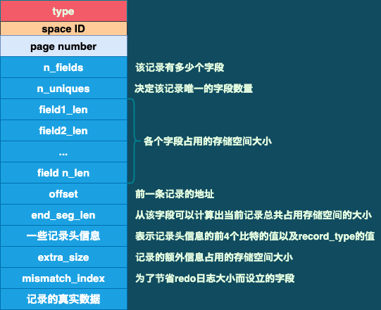

# redo日志

> **redo日志的好处:**
>
> + **redo日志占用的空间非常小: 在存储表空间ID、页号、偏移以及需要更新的值时，需要的存储空间很小。**
> + **redo日志是顺序写入磁盘的**

## 1. redo日志格式

> **`redo日志本质上只是记录了一下事务对数据库进行了哪些修改`。**
>
> **InnoDB针对事务对数据库不同修改场景，定义了多种类型的redo日志，但绝大部分类型的redo日志都有如下的通用结构:**
>
> 
>
> 
>
> > + **type: 这条redo日志的类型**
> > + **space ID: 表空间ID**
> > + **page number: 页号**
> > + **data: 这条redo日志的具体内容**

**引子: **

**在介绍InnoDB记录行格式的时候说过，如果没有为某个表显式地定义主键，并且表中也没有定义不允许存储NULL值的UNIQUE键，那么InnoDB会自动为表添加一个名为 row_id 的隐藏列作为主键。**

**这这个row_id隐藏列进行赋值的方式如下: **

+ **服务器会在内存中维护一个全局变量，每当向某个包含row_id隐藏列的表中插入一条记录时，就会把这个全局变量的值当作新记录的row_id列的值，并且把这个全局变量自增1**
+ **每当这个全局变量的值为256的倍数时，就会将该亦是的值刷新到系统表空间页号为7的页面中一个名为 Max Row ID 的属性中（之所以不是每次自增该全局变量时就将该值刷新到磁盘，是为了避免频繁刷盘）**
+ **当系统启动时，会将这个 Max Row ID属性加载到内存中，并将该值加上256之后赋值给前面提到的全局变量（因为在系统上次关机时，该全局变量的值可能大于磁盘国页面中Max Row ID属性的值）**

**这个Max Row ID属性占用的存储空间是8字节。当某个事务向某个包含row_id隐藏列的表插入一条记录，并且为该记录分配的 row_id值256的倍数时，就会向系统表空间页号为7的页面的相应偏移量处写入8字节的值。但是要知道，这个写入操作实际上是在Buffer Pool中完成的，需要把这次对这个页面的修改以redo日志的形式记录下来。这样在事务提交之后，即使系统崩溃了，也可以将该页面恢复成崩溃前的状态。`在这种对页面的修改是极其简单的情况下，redojjvn中只需要记录一下在某个页面的某个偏移量处修改了几个字节的值、具体修改后的内容是啥就好了。`**

> **InnoDB把这种极其简单的redo日志称为物理日志。并且根据在页面中写入数据的多少划分了几种不同的redo日志类型**

### 1.1 简单的redo日志类型

+ **MLOG_1BYTE: type值为1，表示在页面的某个偏移量处写入1字节的redo日志类型**

+ **MLOG_2BYTE: type值为2**

+ **MLOG_4BYTE: type值为4**

+ **MLOG_8BYTE: type值为8**

  > **上面提到的Max Row ID属性实际占用8字节的空间，所以修改页面中的这个属性时，会记录一条 MLOG_8BYTE的redo日志，格式如下: **
  >
  >  

+ **MLOG_WRITE_STRING: type值为30，表示在页面的某个偏移量处写入一处字节序列**

  > **因为不能确定写入的具体数据占用多少字节，所以需要在日志结构中添加一个len字段: **
  >
  >  

### 1.2 复杂一些的redo日志类型

> **有时，在执行一条语句时会修改非常多的页面，包括系统数据页面和用户数据页面（用记数据指的就是聚簇索引和二级索引对应的B+树）。以一条INSERT语句为例，它除了向B+树的页面中插入数据外，也可能更新系统数据 Max Row ID的值。不过对于用户来说，平时更关心的是语句对 B+树的所做的更新。**
>
> + **表中包含多少个索引，一条INSERT语句就可能更新多少棵B+树**
> + **针对某一棵B+树来说，既可能更新叶子节点为页面，也可能更新内节点页面，还可能创建新的页面（在该记录插入的叶子节点的剩余空间比较少，不足以存放该记录时，会进行页面分裂，在内节点页面中添加目录项记录）**

> **在语句执行过程中，INSERT语句对所有页面的修改都得保存到redo日志中去。这句话说的比较轻巧，做起来可就比较麻烦了。比如，在将记录插入到聚簇索引中时，如果定位到的叶子节点的剩余空间足够存储该记录，那么只更新该叶子节点页面，并只记录一条MLOG_WRITE_STRING 类型的redo日志，表明在页面的某个偏移量处增加了哪些数据不就好了么？？？？**
>
> **`但是，别忘了，一个数据页中除了存储实际的记录之外，还有File Header、Page Header、Page Directory等部分（参考3.InnoDB数据页结构.md）。所以每往顺子节点代表的数据页中插入一条记录，还有其它很多地方会跟着更新新，比如: `**
>
> + **可能更新Page Directory中的槽信息**
> + **可能更新Page Header 中的各种页面统计贪睡，比如PAGE_N_DIR_SLOTS表示的槽数量可能会更改，PAGE_HEAP_TOP代表的还未使用的空间最小地址可能会更改，PAGE__N_HEAP代表的本碳中的记录数量可能会更改.....，各种信息都可能会被更改**
> + **数据页中的记录按照索引从小到大的顺序组成一个单向链表，每插入一条记录，还需要更新上一条记录的记录头信息中的next_record属性来维护这个单向链表**
> + **......**

> **上面说了很多，就是想表明: 在把一条记录插入到一个页面时，需要更改的地方非常多。这时如果使用前面介绍的简单物理redo日志来记录这些修改，可以有两种解决方案: **
>
> + **方案1: 在每个修改的地方都记录一条redo日志**
>
>   > **问题: 被修改的地方实在太多了，可能redo日志占用的空间都要比整个页面占用的空间多**
>
> + **方案2: 将整个页面每一个被修改的字节到最后一个被修改的字节之间所有的数据当成一条物理redo日志中的具体数据**
>
>   > **问题: 同样是太浪费空间**

> **所以InnoDB中提出了一些新的redo日志类型:**
>
> + **MLOG_REC_INSERT: type为9，表示插入一条使用非紧凑行格式（REDUNDANT）的记录**
> + **MLOG_COMP_REC_INSERT: type为38，插入一条使用紧凑行格式（COMPACT、DYNAMIC、COMPRESSED）的记录**
> + **MLOG_COMP_PAGE_CREATE: type为68，创建一个存储紧凑行格式记录的页面**
> + **MLOG_COMP_REC_DELETE: type为42，删除一条使用紧凑行格式记录**
> + **MLOG_COMP_LIST_START_DELETE: type为44，从某条给定记录开始删除页面中一系列使用紧凑行格式的记录**
> + **MLOG_COMP_LIST_END_DELETE: type为43，与MLOG_COMP_LIST_START_DELETE类型日志响应，表示删除一系列记录，直到本类型的redo日志对应的记录为止**
> + **MLOG_ZIP_PAGE_COMPRESS: type为51，压缩一个页面**

> **上面说的redo日志既包含物理层的意思，也包含逻辑层面的意思:**
>
> + **从物理层面看，这些日志都指明了对哪个表空间的哪个页进行修改**
> + **从逻辑层面看，在系统崩溃重启时，`并不能直接根据这些日志中的记载，在页面内的某个偏移量处恢复某个数据`，而是需要调用一些事先准备好的函数，在执行完这些函数后才可心将页面恢复成系统崩溃前的样子**

> **以 MLOG_COMP_REC_INSERT类型redo日志为例:**
>
>  
>
> > **注: **
> >
> > + **在一个数据页中，无论是叶子节点还是非叶子节点，记录都是按照索引列的值从小到大的顺序排序的。对于二级索引来说，当索引列的仩相同时，记录还需要按照主键值进行排序。n_uniques 的含义是在一条记录中，需要几个字段的值才能确保存记录的唯一性，这样在插入一条记录时，就可以按照记录的前 n_uniques个字段进行排序。对于聚簇索引来说，n_uniques的值为主键的列数；对于二级索引来说，该值为索引列中包含的列数+主键列数。**
> > + **field1_len~fieldn_len 代表该记录若干个字段占用存储空间的大小。需要注意的是，`无论该字段的类型是固定长度类型(如INT)，还是可变长度类型(如VARCHAR(M))，该字段占用的存储空间大小始终要写入redo日志`**
> > + **offset 代表该记录的前一条记录在页面中的地址。为什么要记录前一条记录的地址?? `因为每向数据页插入一条记录，都需要修改该页面中维护的记录链表。在插入新记录时，需要修改前一条记录的 next_record属性`**
> > + **一条记录由额外信息和真实数据这两部分组成，这两个部分的总大小就是一条记录占用存储空间的总大小。通过 end_seg_len值 可以间接地计算出一条记录存储空间的总大小**
>
> **`显然，这个 MLOG_COMP_REC_INSERT 类型的redo日志并没有记录 PAGE_N_DIR_SLOTS、PAGE_HEAP_TOP、PAGE_N_HEAP等的值被修改成什么，而只是把在本页面中插入一条记录所有必备的要素记了下来。之后系统因崩溃而重启后，服务会调用向某个页面插入一条记录的相关函数，而redo日志中的这些数据就可以当成调用这个函数所需要的参数。在调用完该函数后，页面中的PAGE_N_DIR_SLOTS等信息也都被恢复到系统崩溃前的样子了，这就是"逻辑层面"的意思`**

## 2. Mini-Transaction

### 2.1 以组的形式写入redo日志

> **语句在执行过程中可能会悠若干个页面。这些页面的更改都发生在Buffer Pool中，所以在修改完页面之后，需要记录相应的redo日志。**
>
> **在执行语句的过程中产生的redo日志， 被人为划分成了若干个不可分割的组，比如:**
>
> + **更新 Max Row ID属性时产生的redo日志为一组，不可分割**
> + **向聚簇索引对应B+树页面中插入一条记录时产生的redo日志是一组，不可分割**
> + **向某个二级索引对应的B+树页面插入一条记录时产生的redo日志是一组**
> + **其它**
>
> > **怎么理解"不可分割"?? 以向某个索引对应的B+树页面插入一条记录为例，在向B+树中插入这条康之前是，需要先定位这条记录应该被插入到哪个叶子节点为代表的数据页中。在定位到具体的数据页后，有两种可能情况: **
> >
> > + **情况1: 该数据页剩余的空间足够容纳这一条待插入记录。这样就可以直接把记录插入到这个数据页中，然后记录一条MLOG_COMP_REC_INSERT类型的redo日志就好了，这种情况称为`乐观插入`**
> >
> > + **情况2: 该数据页剩余空间不足，就需要进行页分裂操作，即新建一个叶子节点，把原先数据页中的一部分记录复制到这个个新的数据页中，然后再把记录插入进去；再把这个叶子节点插入到叶子节点链表中，最后还要在内节点中添加一条目录项记录来指向中这个新创建的页面。显然，这意味着会产生多条redo日志，这种情况称为`悲观插入`**
> >
> >   > **这里还有一种特殊情况就是内节点的空间也不足，就会导致对内节点也要进行页分裂操作，继而产生更多的redo日志**

**`InnoDB中规定不管乐观插入还是悲观插入，为了保证原子性的操作，都必须是组的形式来记录redo日志。在进行恢复时，针对某个组中的redo日志，要么把全部的日志都恢复，要么一条也不恢复`。InnoDB中是怎么做到的呢? 得分情况讨论:**

+ **有些需要保证原子性的操作会生成多条redo日志**

  > **如何把这些redo日志划分到一个组里面呢? InnoDB会在该组的最后一条redo日志后面加一条特殊类型的redo日志。`该类型的redo日志名称为 MLOG_MULTI_REC_END，它只有一个type字段: `**
  >
  >  
  >
  > > **`所以需要保证原子性的操作所产生的一系列redo日志，必须以一条类型为MLOG_MULTI_REC_END的redo日志结尾。`这样在系统因崩溃而重启恢复时，只有解析到类型为MLOG_MULTI_REC_END的redo日志时，才认为解析到了一组完整的redo日志，才会进行恢复；否则直接放弃前面解析到的redo日志**

+ **有些需要保证原子性的操作只生成一条redo日志**

  > **根据type字段的最高位判断，如果最高位是1，则代表这个需要保证原子性的操作只产生了一条单一redo日志，否则就表示这个需要保证原子性的操作产生了一系列的redo日志**

### 2.2 Mini-TRansaction的概念

> **MySQL中把对底层页面进行一次原子访问的过程称为一个 `Mini-Transaction（MTR）`。通过上面的说明可以知道，一个MTR可以包含一组redo日志，在进行崩溃恢复时，需要把这一组redo日志作为一个不可分割的整体来处理。**
>
> **一个事务可以包含若干条语句，每一条语句又包含若干个MTR，每一个MTR又可以包含若干条redo日志，如下图:**
>
>  

## 3. redo日志的写入过程

### 3.1  redo log block

> **为了更好地管理redo日志，InnoDB把通过MTR生成的redo日志都放在了大小为512字节的页中。`为了与以前提到的表空间中的页进行区别，这里把用来存储redo日志的页称为block。` 一个redo log bock的结构大致如下: **
>
>  
>
> > **log block header几个属性的意思: **
> >
> > + **LOG_BLOCK_HDR_NO:  每个block都有一个大于0的唯一编号**
> >
> > + **LOG_BLOCK_HDR_DATA_LEN: 表示本block中已经使用了多少字节：初始值为12（因为log block body从第12字节处开始）。如果block body被全部写满，则本属性值会被设置为512**
> > + **LOG_BLOCK_FIRST_REC_GROUP: 一条redo日志也可以称为一条redo日志记录。一个MTR会产生多条redo日志记录，这个MTR生成的这些redo日志记录被称为一个redo日志记录组(redo log record group)。LOG_BLOCK_FIRST_REC_GROUP就代表该block中第一个MTR生成的redo日志记录组的偏移量，其实也就这个block中第一个MTR生成的第一条redo日志记录的偏移量（如果一个MTR生成的redo日志模跨了好多个block，那么最后一个block中的LOG_BLOCK_FIRST_REC_GROUP属性就表达这个MTR对应的redo日志结束的地方，也就是下一个MTR生成的redo日志开始的地方）**
> > + **LOB_BLOCK_CHECKPOINT_NO: checkpoint的序号**
>
> > **log block trailer中主要是block的检验值，略过**

### 3.2 redo日志缓冲区

> **以前说过，InnoDB为了解决磁盘速度过慢的问题而引入了Buffer Pool。同理，写入redo日志时也不能直接写到磁盘中，在服务器启动时就向操作系统申请了一大片称为 redo log buffer（redo日志缓冲区）的连接内存空间，也可以简称为log buffer。这片内存空间被划分为若干个连续的redo log block，如下图: **
>
>  
>
> > **`可以通过启动选项 innodb_log_buffer_size 来指定 log bufffer的大小。在MySQL 5.7中，该启动选项默认值为 16MB`**

### 3.3 redo日志写入log buffer

> **向log buffer中写入redo日志的过程是顺序写入的，也就是先往前面的block中写，当该block的空闲空间用完之后再往下一个block中写。**
>
> **当想往log buffer写入redo日志时，第一个问题就是，应该写在哪个block的哪个偏移量处??? `InnoDB中提供了一个buf_free全局变量，该变量指明后续写入的redo日志应该写到log buffer中的哪个位置。`**
>
> 