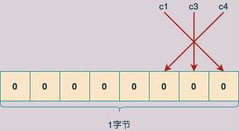
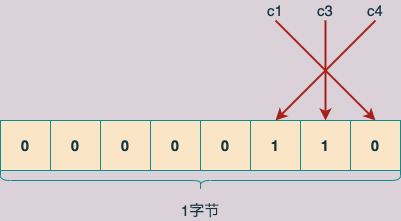
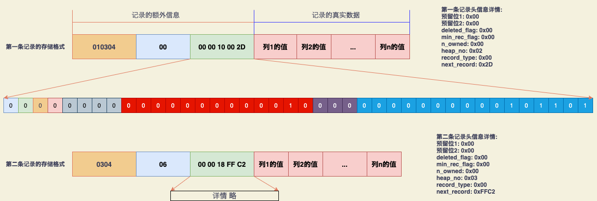
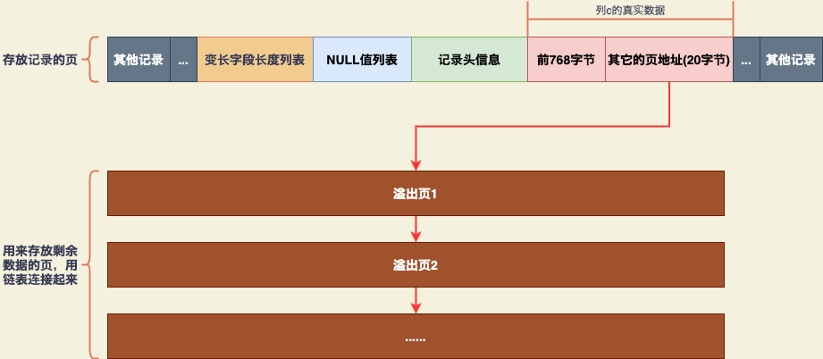

# InnoDB行格式

> **InnoDB是以记录为单位向表中插入数据的，这些记录在磁盘上的存放形式被称为行格式或者记录格式。**
>
> **InnoDB到目前为止设计了4种不同类型的行格式: COMPACT、REDUNDANT、DYNAMIC、COMPRESSED**


## 1. 指定行格式的sql语法

> ```sql
> CREATE TABLE 表名 (列信息) ROW_FORMAT=行格式名称; 
> 
> ALTER TABLE 表名 ROW_FORMAT=行格式名称;
> ```


**示例表和数据**

```sql
create database xiaohaizi;

create table record_format_demo (
    c1 varchar(10),
    c2 varchar(10) not null,
    c3 char(10),
    c4 varchar(10)
) charset=ascii row_format=compact;
    
insert into record_format_demo (c1, c2, c3, c4) values ('aaaa', 'bbb', 'cc', 'dd'), ('eeee', 'fff', NULL, NULL); 

mysql> select * from record_format_demo;
+------+-----+------+------+
| c1   | c2  | c3   | c4   |
+------+-----+------+------+
| aaaa | bbb | cc   | dd   |
| eeee | fff | NULL | NULL |
+------+-----+------+------+
2 rows in set (0.00 sec)
```


## 2. COMPACT 行格式

> **行格式示意图: **
>
>  
>
>
> **从图中可以看出，一条完整的记录其实可以被分成记录的额外信息和记录的真实数据两大部分**


### 2.1 记录的额外信息

> **这部分信息是服务器为了更好地管理记录而额外添加的一些信息，主要分为三个部分: `变长字段长度列表、NULL值列表和记录头信息`**


#### 2.1.1 变长字段长度列表

> **由于MySQL 支持变长的数据类型，如VARCHAR(M)、VARBINARY(M)、各种TEXT类型、各种BLOB类型。 可以把拥有这些数据类型的列称为变长字段。 `变长字段中存储多少字节的数据是不固定的，所以在存储真实数据的时候需要把这些数据占用的字节数也存起来`。**
>
> **也就是说变长字段占用的存储空间分为两部分: **
>
> + **真正的数据内容**
> + **该数据占用的字节数**

> **在COMPACT行格式中， 所有变长字段的真实数据占用的字节数都存放在记录的开头位置，从而形成一个变长字段长度列表。**
>
> **`各变长字段的真实数据占用的字节数按照列的顺序逆序存放，强调一下，是逆序存放`**


> **以record_format_demo表中的第一条记录来举例。因为record_format_demo表的c1、c2、c4列都是VARHCAR(10)类型的，也就是变长的数据类型，所以这3个列的值占用的存储空间字节数都需要保存在记录开头处。 **
>
> **record_format_demo表中各个列使用的都是ascii字符集，每个字符只需要一个字节来编码，所以第一条记录各变长字段内容长度如下表: **
>
> | 列名 | 存储内容 | 内容长度(十进制表示) | 内容长度(十六进制表示) |
> | ---- | -------- | -------------------- | ---------------------- |
> | c1   | 'aaaa'   | 4                    | 0x04                   |
> | c2   | 'bbb'    | 3                    | 0x03                   |
> | c4   | 'd'      | 1                    | 0x01                   |
>
> **因为这些长度值需要按照列的顺序`逆序存放`，所以最后变长字段长度列表的字节串用十六进制表示的效果就是: **
>
> ```shell
> 01 03 04 #需要注意的是，各个字节之间实际上没有空格, 这里用空格是为了方便阅读
> ```
>
> **所以，将第一条记录的变长字段长度列表填入COMPACT行格式后的内容为: **
>
>  


> ***`注意:`***
>
> + **1. 由于第1条记录中c1、c2、c4列中的字符串都比较短，也就是说占用的字节数比较小，每个变长字段的内容占用的字节数用1字节就可以表示。`但是，如果变长字段的内容占用的字节数比较多，可能就需要2个字节来表示`。至于用1字节还是2字节来表示变长字段的真实数据占用的字节数，`InnoDB有它的一套规则`，规则如下描述: **
>
>   > **引入W、M 和 L 这几个符号，意思如下: **
>   >
>   > + **假设某个字符集中最多需要W字节来表示一个字符（也就是执行`SHOW CHARSET`语句后结果中的Maxlen列）。比如utf8mb6字符集中的W就是4，utf8字符串中的W就是3，gkb字符串中的W就是2，ascii字符串中W就是1**
>   > + **对于变长类型VARCHAR(M)来说，这种类型表示能存储最多M个字符（注意是`字符`不是字节），所以这种类型能表示的字符串最多占用的字节数就是 `M * W`**
>   > + **假设该变长字段实际存储的字符串占用的字节数是L**
>
>   > **则确定使用1字节还是2字节来表示一个变长字段的真实数据占用的字节数的规则为: **
>   >
>   > + **如果 M*W <= 255，那么使用1字节来表示真实数据占用的字节数**
>   > + **如果 M*W > 255，则分为下面两种情况: **
>   >   + **如果 L <= 127， 则用1字节来表示真实数据占用的字节数，这1个字节的最高位为0**
>   >   + **如果 L > 127，则用2字节来表示真实数据占用的字节数，且这两个字节中，第1个字节的最高位为1，来表示这是2字节值中的第1个字节**
>
> + **2. 变长字段长度列表中`只存储值为非NULL的列的内容长度`，不存储值为NULL的列的内容长度。也就是说，对于示例的record_format_demo表中的第二条记录，因为c4列的值为NULL，所以第二条记录的变长字段长度列表只需要存储c1和c2列的内容长度即可。如下图所示: **
>
>    
>
> + **3. 根据变长字段长度以列表的含义，如果表中所有的列都不是变长的数据类型或者所有列的值都是NULL的话，就不需要有变长字段长度列表**
>
> + **4. CHAR(M)列的存储格式需要注意: `示例表中c3列类型为 CHAR(10), 不属于变长字段，但是这只是建立在record_format_demo表采用的是ascii字符集的情况下`。 **
>
>   > **ascii字符集采用固定的一个字节来编码一个字符，是一个定长编码字符串，所以在采用ascii字符集的情况下，CHAR(10) 类型的c3列占用的空间是固定的10字节大小。**
>   >
>   > **但是，如果示例表采用的是变长编码的字符串，如（utf8表示一个字符需要 1～3字节，gbk表示一个字符需要1~2字节），`在这种情况下，即使是 CHAR(10)类型的c3列，它占用的空间字节数也是不固定的，即某条记录的c3列内容占用的字节数也会出现在变长字段长度列表。`**


#### 2.1.2 NULL值列表

> **上面说到了，变长字段长度列表中只存储值为非NULL的列的内容长度。但一条记录中某些列确实可能存储NULL值，如果将这些NULL值都放到记录的真实数据中存储会很占地方，`所以COMPACT行格式把一条记录中值为NULL的列统一管理起来，存储到NULL值列表中`，它的处理过程如下: **
>
> + **1. 首先统计表中允许存储NULL的列有哪些: 主键列以及使用NOT NULL修饰的列都是不可以存储NULL值的，所以在统计时不会把这些列算进去。比如表record_format_demo的3个列c1、c3、c4都允许存储NULL值，而c2列使用NOT NULL进行了修饰，不允许存储NULL值**
>
> + **2. 如果表中没有允许存储NULL的列，则NULL值列表也就不存在了，否则`将每个允许存储NULL的列对应一个二进制位，二进制位按照列的顺序逆序排列`。二进制位表示的意义如下: **
>
>   > + **二进制位的值为1时，代表该列的值为NULL**
>   > + **二进制位的值为0时，代表该列的值不为NULL**
>   >
>   > ***`再次强调: 二进制位按照列的顺序逆序排列，所以第一个列c1和最后一个二进制位对应`***
>
> + **3. MySQL规定NULL值列表`必须用整数个字节的位表示`，如果使用的二进制个数不是整数个字节，`则在字节的高位补0` **
>
>   > **如表record_format_demo 只有3个值允许为NULL的列，对应3个二进制位，不足一个字节，所以在字节的高位补0，效果如下所示:**
>   >
>   >  
>
>   > **依此类推，如果一个表中有9个值允许为NULL的列，则这个记录的NULL值列表部分就需要2字节来表示了**
>   >
>   > **1. 对于record_format_demo表中的第一条记录，c1、c3、c4》 这三个列的值都不为NULL，结果如下图: **
>   >
>   >  
>   >
>   > **2. 对于第二条记录，c3、c4字段的值均为NULL，所以它的NULL值列表如下图: **
>   >
>   >  


> **所以两条记录在填充了NULL值列表后的表示结果如下图: **
>
>  


#### 2.1.3 记录头信息

> **`记录头信息由固定的5字节组成`，用于描述记录的一些属性。**
>
> **如下图: **
>
>  

> | 名称         | 大小(位) | 描述                                                         |
> | ------------ | -------- | ------------------------------------------------------------ |
> | 预留位1      | 1        | 没有使用                                                     |
> | 预留位2      | 1        | 没有使用                                                     |
> | deleted_flag | 1        | 标记记录是否被删除                                           |
> | min_rec_flag | 1        | B+树每层非叶子节点中最小的目录项记录都会添加该标记           |
> | n_owned      | 4        | 一个页面中的记录会被分成若干个组，每个组中有一个记录是"带头大哥"，其余的记录都是"小弟"。"带头大哥"记录的n_owned值代表该组中所有的记录条数，"小弟"记录的n_owned都为0 |
> | heap_no      | 13       | 当前记录在页面堆中的相对位置                                 |
> | record_type  | 3        | 当前记录的类型，0表示普通记录，1表示B+树非叶子节点的目录项记录，2表示Infimun记录，3表示Supremum记录 |
> | next_record  | 16       | 下一条记录的相对位置                                         |
>
> **另外，记录头信息的前4个位也被称为info bit**


> **所以示例表中两条记录加入记录头信息后的格式如图: **
>
>  


### 2.2 记录的真实数据

> **对于 record_format_demo 表来说，记录的真实数据除了c1、c2、c3、c4这几个定义的列的数据外，MySQL还会为每个记录默认地添加一些列（也称为隐藏列），如下表: **
>
> | 列名         | 是否必需 | 占用空间(字节) | 描述                   |
> | ------------ | -------- | -------------- | ---------------------- |
> | row_id       | 否       | 6              | 行ID，唯一标识一条记录 |
> | trx_id       | 是       | 6              | 事务ID                 |
> | roll_pointer | 是       | 7              | 回滚指针               |
>
> 
>
> > **提一下INNODB表的主键生成策略: `优先使用用户自定义的主键作为主键；如果没有定义主键，则选取一个不允许存储NULL值的UNIQUE键作为主键；如果表中连不允许NULL值的UNIQUE键都没有定义，则InnoDB会为表默认添加一个名为row_id的隐藏列作为主键`**


**因为表record_format_demo表并没有定义主键，所以MySQL会为每条记录增加上述的三个列。如下图: **

 


> **需要注意: **
>
> + **1. 表record_format_demo 使用的是ascii字符集， 所以 0x61616161 就表示字符串'aaaa'， 0x626262 就表示字符串'bbb'，依此类推**
> + **2. 第一条记录中 c3 列是 CHAR(10) 类型的，它实际存储的字符串是'cc'，使用ascii字符集来编码这个字符串得到的结果是'0x6363'。`虽然表示这个字符串只占用了2字节，但整个c3列仍然占用了10字节的空间，除真实数据以外的8字节都用空格字符填充，空格字符在ascii字符集中的编码就是0x20`**
> + **3. 第二条记录中c3和c4列的值都为NULL，它们被存储在了前面的NULL值列表处，在记录的真实数据处就不再冗余存储，从而节省了存储空间**


### 2.3 CHAR(M)列的存储格式

> **主要说明的就是，在变长编码字符集的表中，即使列的类型是CHAR(M)，它也是一个变长字段，记录中同样需要在"变长字段长度列表"中保存实际长度值。 参考 2.1.1 节内容**


## 3. REDUNDANT、DYNAMIC、COMPRESSED行格式

> **略，以后有时间再整理**


> **这里主要提一下DYNAMIC行格式，`在MySQL 5.7版本后，默认的行格式就是 DYNAMIC`。**
>
> **它的结构基本与COMPACT行格式相同，区别只是在于对溢出列的处理: **
>
> > **DYNAMIC行格式中，不会在溢出列的真实数据处存储实际内容的前768字节，而是把该列的所有真实数据都存储到溢出页中，只在记录的真实数据处存储20字节大小的指向溢出页的地址（这20字节还包括真实数据占用的字节数）**


## 4. 溢出列

### 4.1 溢出列

> **以ascii字符集的 off_page_demo表为例，并向该表中插入一条记录: **
>
> ```shell
> mysql> CREATE TABLE off_page_demo (
>     -> c VARCHAR(65532)
>     -> ) CHARSET=ascii ROW_FORMAT=COMPACT;
>     
> mysql> INSERT INTO off_page_demo (c) VALUES (REPEAT('a', 65532));
> Query OK, 1 row affected (0.01 sec)
> ```


> **表中记录的c列内容长度以为 65532字节。但是InnoDB是以页为单位来存储数据的，一个页的大小一般是16KB，即16384字节。所以本例中的C列内容在无法在一个页中存储，而是需要多个页面。**


> **`在COMPACT和REDUNDANT行格式中，对于占用存储空间非常多的列，在记录的真实数据处只会存储该列的一部分数据（列的前768字节数据），而把剩余的数据分散存储在几个其它的页中，然后在记录的真实数据处用20字节存储指向这些页的地址（这20字节还包括分散在其它页面中的数据所占的字节数），从而可以找到剩余数据所在的页`**
>
>  


### 4.2 产生溢出列的临界点

> **略**