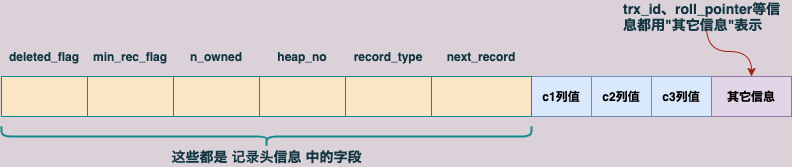

# InnoDB数据页结构

## 1. 结构字段

 


| 名称               | 占用空间(字节) | 描述                   |
| ------------------ | -------------- | ---------------------- |
| File Header        | 38             | 页的一些通用信息       |
| Page Header        | 56             | 数据页专有的一些信息   |
| Infimum + Supremum | 26             | 两个虚拟的记录         |
| User Records       | 不确定         | 用户存储的记录内容     |
| Free Space         | 不确定         | 页中尚未使用的空间     |
| Page Directory     | 不确定         | 页中某些记录的相对位置 |
| File Trailer       | 8              | 校验和                 |


## 2. 页中存储的记录

> **一开始生成页的时候，数据页中并没有"User Records"部分，每插入一条记录时，都会从"Free Space"部分申请一个记录大小的空间，并将这个空间划分到User Records部分。当Free Space部分的空间全部被User Records部分替代掉之后，也就意味着这个页使用完了，此时如果还有新的记录插入，就需要去申请新的页了。**

 


> **大致数据插入过程如上图所示，但继而引出的问题就是: `一个16KB的页中可能包含很多数据记录，如何更好的管理Users Records中的这些记录`。**


### 2.1 记录头信息

> **关于记录头信息结构，参考《2. InnoDB行格式.md》**
>
> **以COMPACT行格式为例，记录头字段如下: **
>
>  
>
> > | 名称         | 大小(位) | 描述                                                         |
> > | ------------ | -------- | ------------------------------------------------------------ |
> > | 预留位1      | 1        | 没有使用                                                     |
> > | 预留位2      | 1        | 没有使用                                                     |
> > | deleted_flag | 1        | 标记记录是否被删除                                           |
> > | min_rec_flag | 1        | B+树每层非叶子节点中最小的目录项记录都会添加该标记           |
> > | n_owned      | 4        | 一个页面中的记录会被分成若干个组，每个组中有一个记录是"带头大哥"，其余的记录都是"小弟"。"带头大哥"记录的n_owned值代表该组中所有的记录条数，"小弟"记录的n_owned都为0 |
> > | heap_no      | 13       | 当前记录在页面堆中的相对位置                                 |
> > | record_type  | 3        | 当前记录的类型，0表示普通记录，1表示B+树非叶子节点的目录项记录，2表示Infimun记录，3表示Supremum记录 |
> > | next_record  | 16       | 下一条记录的相对位置                                         |
> >


#### 2.1.1 示例表

> ```sql
> mysql> CREATE TABLE page_demo (
>     ->     c1 INT,
>     ->     c2 INT,
>     ->     c3 VARCHAR(10000),
>     ->     PRIMARY KEY (c1)
>     -> ) CHARSET=ascii ROW_FORMAT=COMPACT;
> Query OK, 0 rows affected (0.03 sec)
> 
> mysql> INSERT INTO page_demo VALUES(1, 100, 'aaaa'), (2, 200, 'bbbb'), (3, 300, 'cccc'), (4, 400, 'dddd');
> Query OK, 4 rows affected (0.00 sec)
> Records: 4  Duplicates: 0  Warnings: 0
> ```


#### 2.1.2 行记录简化图

> **为了方便理解记录头信息的作用，将使用简化后的行记录结构，如下图: **
>
>  


**按照上面的行记录结构，page_demo表中的数据在`页的User Records部分`的表示如下图: **

 


**记录头信息中的属性，结合上面的图进行说明: **

+ **deleted_flag: 标识当前记录是否被删除，为1时表示记录被删除了。`被删除的记录不会从磁盘上移除，因为在移除它们之后，还需要在磁盘上重新排列其它的记录，会带来性能消耗，所以只打了一个删除标记`。 `所有被删除掉的记录会组成一个垃圾链表`。`记录在这个链表中占用的空间称为可重用空间（关于链表，参考next_record属性）`。之后如果有新记录插入到表中，可能覆盖掉被删除的这些记录占用的空间**

+ **min_rec_flag: B+树每层叶子节点中的最小的目录项记录都会添加该标记。`引出了三个概念，B+树、非叶子节点、目录项记录，//TODO，后面的时间整理`**

+ **n_owned: `Page Directory相关，下面会详细说明`**

+ **heap_no: 向表中插入的记录从本质上来说都是放到数据页的User Records部分，这些记录一条一条紧挨着排列，InnoDB把这个排列起来的结构称为`堆`。`为方便管理堆，把一条记录（包括 deleted_flag 为1的记录）在堆中的相对位置称为 heap_no`。所以在页面前边的记录heap_no相对较小，排后边的记录heap_no相对较大，`每新申请一条记录的存储空间时，该条记录比物理位置在它前边的那条记录的heap_no值大1`。 **

  > **上面的示例中，page_demo表的各条记录的heap_no属性值分别为2、3、4、5 。`问题: 怎么没有heap_no值为0和1的记录?`**

  > **`InnoDB自动为每个数据页里面加了两条记录，也称为伪记录或虚拟记录`。两条伪记录中，一条代表页面中的最小记录（`Infimum记录`，heap_no为0），另一条代表页面中的最大记录（`Supremum记录`，heap_no为1）。并且由heap_no值，也说明这两条伪记录也算作堆的一部分。**

