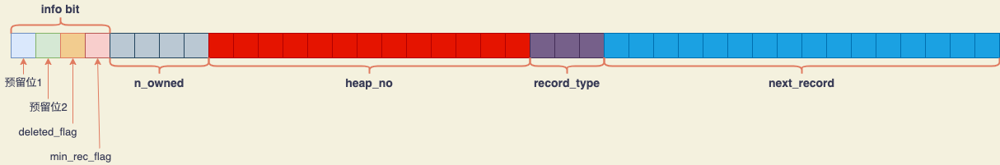
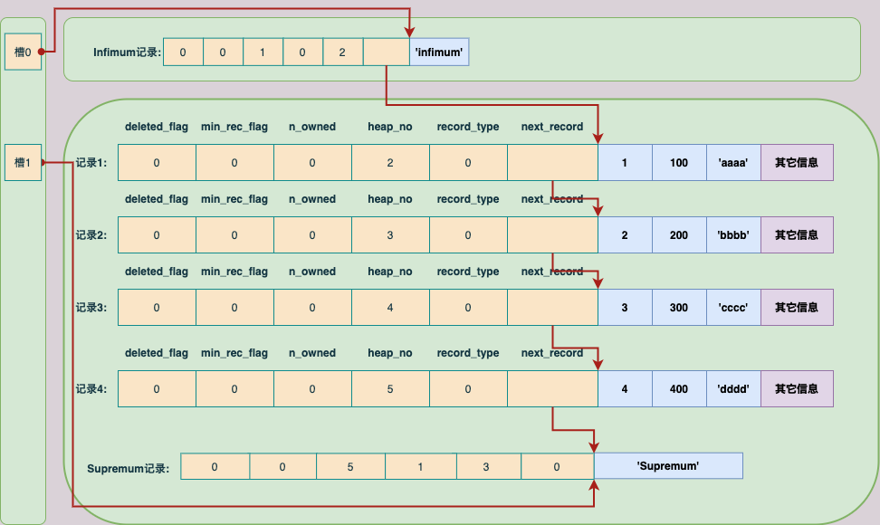
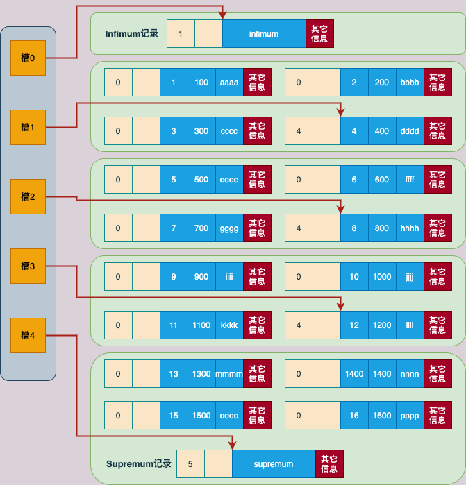

# InnoDB数据页结构

## 1. 结构字段

 


| 名称               | 占用空间(字节) | 描述                   |
| ------------------ | -------------- | ---------------------- |
| File Header        | 38             | 页的一些通用信息       |
| Page Header        | 56             | 数据页专有的一些信息   |
| Infimum + Supremum | 26             | 两个虚拟的记录         |
| User Records       | 不确定         | 用户存储的记录内容     |
| Free Space         | 不确定         | 页中尚未使用的空间     |
| Page Directory     | 不确定         | 页中某些记录的相对位置 |
| File Trailer       | 8              | 校验和                 |


## 2. 记录在页中的存储

> **一开始生成页的时候，数据页中并没有"User Records"部分，每插入一条记录时，都会从"Free Space"部分申请一个记录大小的空间，并将这个空间划分到User Records部分。当Free Space部分的空间全部被User Records部分替代掉之后，也就意味着这个页使用完了，此时如果还有新的记录插入，就需要去申请新的页了。**

 


> **大致数据插入过程如上图所示，但继而引出的问题就是: `一个16KB的页中可能包含很多数据记录，如何更好的管理Users Records中的这些记录`。**


### 2.1 记录头信息

> **关于记录头信息结构，参考《2. InnoDB行格式.md》**
>
> **以COMPACT行格式为例，记录头字段如下: **
>
>  
>
> > | 名称         | 大小(位) | 描述                                                         |
> > | ------------ | -------- | ------------------------------------------------------------ |
> > | 预留位1      | 1        | 没有使用                                                     |
> > | 预留位2      | 1        | 没有使用                                                     |
> > | deleted_flag | 1        | 标记记录是否被删除                                           |
> > | min_rec_flag | 1        | B+树每层非叶子节点中最小的目录项记录都会添加该标记           |
> > | n_owned      | 4        | 一个页面中的记录会被分成若干个组，每个组中有一个记录是"带头大哥"，其余的记录都是"小弟"。"带头大哥"记录的n_owned值代表该组中所有的记录条数，"小弟"记录的n_owned都为0 |
> > | heap_no      | 13       | 当前记录在页面堆中的相对位置                                 |
> > | record_type  | 3        | 当前记录的类型，0表示普通记录，1表示B+树非叶子节点的目录项记录，2表示Infimun记录，3表示Supremum记录 |
> > | next_record  | 16       | 下一条记录的相对位置                                         |
> >


#### 2.1.1 示例表

> ```sql
> mysql> CREATE TABLE page_demo (
>     ->     c1 INT,
>     ->     c2 INT,
>     ->     c3 VARCHAR(10000),
>     ->     PRIMARY KEY (c1)
>     -> ) CHARSET=ascii ROW_FORMAT=COMPACT;
> Query OK, 0 rows affected (0.03 sec)
> 
> mysql> INSERT INTO page_demo VALUES(1, 100, 'aaaa'), (2, 200, 'bbbb'), (3, 300, 'cccc'), (4, 400, 'dddd');
> Query OK, 4 rows affected (0.00 sec)
> Records: 4  Duplicates: 0  Warnings: 0
> ```


#### 2.1.2 行记录简化图

> **为了方便理解记录头信息的作用，将使用简化后的行记录结构，如下图: **
>
>  


**按照上面的行记录结构，page_demo表中的数据在`页的User Records部分`的表示如下图: **

 


**记录头信息中的属性，结合上面的图进行说明: **

+ **deleted_flag: 标识当前记录是否被删除，为1时表示记录被删除了。`被删除的记录不会从磁盘上移除，因为在移除它们之后，还需要在磁盘上重新排列其它的记录，会带来性能消耗，所以只打了一个删除标记`。 `所有被删除掉的记录会组成一个垃圾链表`。`记录在这个链表中占用的空间称为可重用空间（关于链表，参考next_record属性）`。之后如果有新记录插入到表中，可能覆盖掉被删除的这些记录占用的空间**

+ **min_rec_flag: B+树每层叶子节点中的最小的目录项记录都会添加该标记。`引出了三个概念，B+树、非叶子节点、目录项记录，//TODO，后面的时间整理`**

+ **n_owned: `Page Directory相关，下面会详细说明`**

+ **heap_no: 向表中插入的记录从本质上来说都是放到数据页的User Records部分，这些记录一条一条紧挨着排列，InnoDB把这个排列起来的结构称为`堆`。`为方便管理堆，把一条记录（包括 deleted_flag 为1的记录）在堆中的相对位置称为 heap_no`。所以在页面前边的记录heap_no相对较小，排后边的记录heap_no相对较大，`每新申请一条记录的存储空间时，该条记录比物理位置在它前边的那条记录的heap_no值大1`。 **

  > **上面的示例中，page_demo表的各条记录的heap_no属性值分别为2、3、4、5 。`问题: 怎么没有heap_no值为0和1的记录?`**

  > **`InnoDB自动为每个数据页里面加了两条记录，也称为伪记录或虚拟记录`。两条伪记录中，一条代表页面中的最小记录（`Infimum记录`，heap_no为0），另一条代表页面中的最大记录（`Supremum记录`，heap_no为1）。并且由heap_no值，也说明这两条伪记录也算作堆的一部分。**
  >
  > **Infimum 和 Supremum 这两条伪记录的构造都是由5字节大小的记录头信息和8字节大小的一个固定单词组成，如下图: **
  >
  >  

  > **Infimum 和 Supremum 两条伪记录是InnoDB默认创建的记录，`为了与用户插入的记录进行区分，不把伪记录存放在页的User Records部分，而是单独放在一个叫做 "Infimum + Supremum" 的部分`，如下图: **
  >
  >  
  >
  > 
  >
  > > **由上图可以看出，Infimum记录和Supremum记录的heap_no值分别是0和1，也就是说它们在堆中的相对位置最靠前。`另外需要注意的是，堆中记录的heap_no值在分配之后就不会发生改动了，即使删除了某条记录，这条被删除的记录的heap_no也保持不变`**

+ **record_type: 当前记录的类型。共有4种类型的记录，0表示普通记录，1表示B+树非叶子节点的目录项记录，2表示Infimu记录，3表示Supremum记录。**

+ **next_record: `重要属性，表示从当前记录的真实数据到下一条记录的真实数据的距离`。`next_record值可能为负数，表示当前记录的下一条记录比当前记录在堆中的位置靠前；如果next_record值为正数，表示下一条记录在当前记录的后面`。**

  **`这里下一条记录指的并不是插入顺序的下一条，而是按照主键值由小到大的顺序排列的下一条`。**

  **`而且规定Infimum记录的下一条记录就是本页中这一切值最小的用户记录，本页中主键值最大的用户记录的下一条记录就是Supremum记录。`**

  **用箭头来替代next_record中的值，则page_demo表中的记录如下图所示: **

   

  > **从图中可以看出，`记录按照主键从小到大的顺序熬成了一个单向链表。Supremum记录的next_record值为0，也就是说Supremum记录之后就没有下一条记录了，即Supremum记录就是这个单向链表中的最后一个节点。`**

  > **如果从表中删除一条记录，表中的记录链表也会跟着发生变化，比如把第2条记录删除: **
  >
  > ```sql
  > DELETE FROM page_demo WHERE c1 =2;
  > ```
  >
  > **执行SQL以后， page_demo表中的记录如下图: **
  >
  >  
  >
  > 
  >
  > > **删除第2条记录后主要发生了下面这些变化: **
  > >
  > > + **第2条记录并没有从存储空间中移除，而是将记录的deleted_flag值设置为1**
  > > + **第2条记录的next_record值变为0，意味着该记录没有下一条记录了**
  > > + **第1条记录的next_record指向了第3条记录**
  > > + **`最后一点，Supremum记录的n_owned值从5变成了4`，关于这一点变化下面会详细介绍**


### 2.2 Page Directory（页目录）

> **如下的查询语句: **
>
> ```sql
> SELECT * FROM page_demo WHERE c1 = 3;
> ```
>
> **在执行时是如何从页中查找到结果记录的??**


> **已知记录在页中按照主键值由小到大的顺序串联成一个单向链表，最简单的实现就是从Infimum记录开始，沿着单向链表一直向后找，但是对性能会有很大损耗。**
>
> **InnoDB为页中的记录制作了一个目录，保存在数据页中的Page Dirctory结构。**
>
> **目录制作过程如下: **
>
> + **1. 将所有正常的记录（包括Infimum和Supremum记录，但不包括已经移除的记录）划分为几个组**
>
> + **2. 每个组的最后一条记录（也就是组内最大的那条记录）相当于"带头大哥"，组内其余的记录相当于"小弟"。"带头大哥"记录的头信息中的 n_owned 属性表示该组内共有几条记录**
>
> + **3.` 将每个组中最后一条记录在页面中的地址偏移量（就是该记录的真实数据与页面中第0个字节之间的距离）单独提出来，按顺序存储到程控页尾部的地方。这个地方就是 Page Directory（页目录）。页目录中的这些地址偏移量称为槽（Slot），每个槽占用2字节`。**
>
>   > **`一个页面16KB，即16384字节，所以一个槽占2字节就足够了`**


> **示例说明: **
>
> **例如，page_demo表中正常的记录共有6条，InnoDB会将它们分成2组，每一组只有一个Infimum记录，第二组是剩余的5条记录。`2个组就对应着2个槽，每个槽中存放每个组中最大的那条记录在页面中的地址偏移量`。如下图所示: **
>
>  
>
> **注意:**
>
> > + **页目录部分中有2个槽，也意味着记录被分成了2个组。槽1中的值是112，代表Supremum记录在页面中的地址偏移量（就是从页面的0字节开始数，数112字节）；槽0中的值是99，代表Infimum记录的地址偏移量**
> > + **注意Infimum记录和Supremum记录的头信息中的 n_owned 属性**
> >   + **Infimum记录的n_owned值为1，这表示以Infimum记录为最后一个节点的这个分组中只有1条记录，也就是Infimum记录自身**
> >   + **Supremum记录的 n_owned 值为5， 这表示以 Supremum记录为最后一个节点的这个分组中有5条记录，即除了Supremum记录自身之外，还有插入的4条记录**
> > + **每个槽占用2字节，按照对应记录的大小相邻分布。槽对应的记录越小，它的位置越靠近File Trailer**
>
> **把上图优化一下，用如下图表示: **
>
>  


> **上面说将page_demo表中的记录划分为2个组，那么分组的依据是什么? 即为什么Infimum记录的n_owned值为1，而Supremum记录的 n_owned 值为5呢? **
>
> **InnoDB对每个分组中的记录条数规定: `对于Infimum记录所在的分组只能有1条记录，Supremum记录所在的分组拥有的记录条数只能在1~8 条之间，剩下的分组中记录的条数范围只能是在 4~8 条之间`。**
>
> **所以给记录分组是按照下面的步骤进行的: **
>
> + **1. 在初始情况下，一个数据页中只有Infimum记录和Supremum记录这两条，它们分属于两个分组。页目录中也只有两个槽，分别代表Infimum记录和Supremum记录在页面中的地址偏移量**
> + **2. 之后每插入一条记录，都会从页目录中找到对应记录的主键值比待插入记录的主键值大并且差值最小的槽（从本质上来说，槽是一个组内最大的那条记录在页面中的地址偏移量，通过槽可以快速找到对应的记录的主键值），然后把该槽对应的记录的 -n_owned值加1，表示本组内又添加了一条记录，直到该组中的记录数等于8个**
> + **3. 当一个组中的记录数等于8后，再插入一条记录，会将组中的记录拆分成两个组，其中一个组中4条记录，另一个5条记录。这个拆分过程会在页目录中新增一个槽，记录这个新增分组中最大的那条记录的偏移量**


### 2.3 用示例表说明记录分组规则

> **往 page_demo 表中添加更多记录: **
>
> ```sql
> mysql> INSERT INTO page_demo VALUES(5, 500, 'eeee'), (6, 600, 'ffff'), (7, 700, 'gggg'), (8, 800, 'hhhh'), (9, 900, 'iiii'), (10, 1000, 'jjjj'), (11, 1100, 'kkkk'), (12, 1200, 'llll'), (13, 1300, 'mmmm'), (14, 1400, 'nnnn'), (15, 1500, 'oooo'), (16, 1600, 'pppp');
> Query OK, 12 rows affected (0.01 sec)
> Records: 12  Duplicates: 0  Warnings: 0
> ```
>
> **现在page_demo数据页中一共有18条记录了（包括Infimum和Supremum记录），它的分组情况如下图: **
>
>  
>
> 
>
> > **注: 由于图中线条比较多，`这里省略了各个记录之间用next_record连接的箭头（没画不代表没有）`，只保留了Page Directory槽的箭头**


### 2.4 在上图中的数据中查找记录

> + **1. 因为一个槽占2个字节，各个槽之间是挨着的，而且穴代表的记录的主键值都是从小到大排序的，所以可以通过二分法快速查找。`关于本数据页Page Directory中共有几个槽，存储在Page Header部分的前2个字节，参考第3节的说明`。**
>
>   **可以通过二分法找到大于等于查找值的记录偏移**
>
> + **通过查找到的槽的前一个槽，来找到目标组的上一个组的最大记录，再从这个记录通过next_record往向遍历，来获取目标记录**
>
> 


## 3. Page Header（页面头部）

> **Page Header是页结构的第2部分，占用固定的56字节，专门存储各种状态信息。**
>
> **其中的字段如下表: **
>
> | 名称              | 占用空间(字节) | 描述                                                         |
> | ----------------- | -------------- | ------------------------------------------------------------ |
> | PAGE_N_DIR_SLOTS  | 2              | 在Page Directory（页目录）中的槽数量                         |
> | PAGE_HEAP_TOP     | 2              | 还未使用的空间最小地址，即该地址之后就是Free Space           |
> | PAGE_N_HEAP       | 2              | 第1位表示本记录是否为紧凑型记录，剩余的15位表示本页的堆中记录的数量（包括Infimum、Supremum、"已删除"标记的记录） |
> | PAGE_FREE         | 2              | **`各个已删除的记录通过next_record组成一个单身链表，这个链表中的记录占用的存储空间可以被重新利用；PAGE_FREE表示该链表头节点对应记录在页面中的偏移量`** |
> | PAGE_GARBAGE      | 2              | 已删除记录占用的字节数                                       |
> | PAGE_LAST_INSERT  | 2              | 最后插入的记录的位置                                         |
> | PAGE_DIRECTION    | 2              | 记录插入的方向                                               |
> | PAGE_N_DIRECTION  | 2              | 一个方向连续插入的记录数量                                   |
> | PAGE_N_RECS       | 2              | **`该页中用户记录的数量（不包括Infimum、Supremum、被删除的记录）`** |
> | PAGE_MAX_TRX_ID   | 8              | **`修改当前页的最大事务id，该值仅在二级索引页面中定义`**     |
> | PAGE_LEVEL        | 2              | 当前页在B+树中所处的层级                                     |
> | PAGE_INDEX_ID     | 8              | 索引ID，表示当前页属于哪个索引                               |
> | PAGE_BTR_SEG_LEAF | 10             | **`B+树叶子节点段的头部信息，仅在B+树的根页面中定义`**       |
> | PAGE_BTR_SEG_TOP  | 10             | **`B+树非叶子节点段的头部信息，仅在B+树的根页面中定义`**     |
>
> > **注: 上面的一些字段还需要结合InnoDB表空间结构进行理解。例如: PAGE_BTR_SEG_LEAF、PAGE_BTR_SEG_TOP两个字段就需要结合《5. InnoDB的独立表空间.md》理解**

