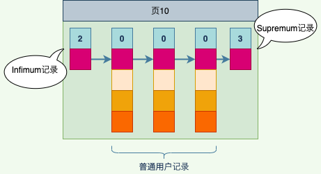
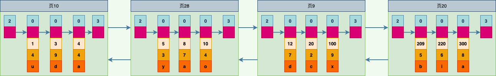
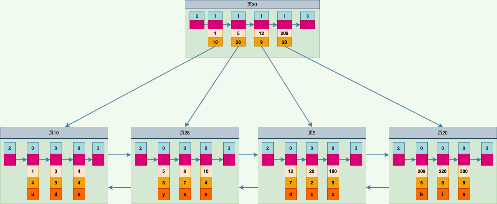

# B+树索引

> 示例表: 
>
> ```mysql
> mysql> CREATE TABLE index_demo (
>     ->     c1 INT,
>     ->     c2 INT,
>     ->     c3 CHAR(1),
>     ->     PRIMARY KEY(c1)
>     -> ) ROW_FORMAT=COMPACT;
> Query OK, 0 rows affected (0.02 sec)
> ```

> 关于具体的行格式，参考《2. InnoDB行格式.md》
>
> 为了方便理解，后面会用简化的行格式示意图: 
>
>  
>
> > **说明:**
> >
> > + **record_type: 记录头信息的一个字段，表示记录类型；0为普通记录，2为Infimum，3为Supremum，1会在下面说明**
> > + **next_record: 记录头信息的一个字段，表示当前记录的真实数据到下一条记录的真实数据的距离**
> > + **各个列的值**
> > + **其它信息: 除上面3种信息以外的所有信息，包括其它隐藏列以及记录的额外信息；`后面会省略`**
>
> > **`注:后面为了节省空间，会把字段说明信息也省略掉，按颜色进行区分；另外会把每条记录的示意图竖起来表示，如下图: `**
> >
> >  


## 1. 索引

> **参考《3. InnoDB数据页结构.md》，在单个数据页中查询记录可以通过`二分法定位分组+单组内循环遍历`的方式实现。**
>
> **数据页中的Page Directory部分可以看作页内记录的目录，索引则是为快速定位记录所在的数据页而建立的页目录。创建索引则是在建立这个页目录的过程。**
>
> **建立的页目录需要完成两件事: **
>
> + **1. 下一个数据页中用户记录的主键值必须大于上一个页中用户记录的主键值**
>
>   > **这里做一个假设: 每个数据页最多能存放3条记录。有了这个假设之后，向index_demo表插入3条记录: **
>   >
>   > ```mysql
>   > mysql> INSERT INTO index_demo VALUES(1, 4, 'u'), (3, 9, 'd'), (5, 3, 'y'), (4, 4, 'a');
>   > Query OK, 4 rows affected (0.00 sec)
>   > Records: 4  Duplicates: 0  Warnings: 0
>   > ```
>   >
>   > > **则表中记录表以表示为:**
>   > >
>   > >  
>   >
>   > > **注: **
>   > >
>   > > 1. **虽然(4, 4, 'a')这条记录的插入顺序排在(5, 3, 'y')记录后面，但是由于`下一个数据页中的用户记录必须大于上一个页中用户记录的主键值`这一限制，所以(5, 3, 'y')被排到(4, 4, 'a')之后**
>   > > 2. **页10的下一页并不一定是页11，它们的数据页编号可能并不连续，它们只是通过维护上一页和下一页的编号而建立了链表关系**
>
> + **2. 给所有有页建立一个目录项**
>
>   > **由于数据页的编号可能并不是连续的，所以在向index_demo表中插入许多条记录后，可能会形成下图所示的效果: **
>   >
>   >  
>
>   > **由于这些大小为16KB的面在磁盘上可能并不挨着，如果想从这么多页中根据主键值快速定位某些记录所在的页，就需要给它们编制一个目录，每个页对应一个目录项，每个目录项包括下面两个部分: **
>   >
>   > + **`页的用户记录中最小的主键值，用key来表示`**
>   > + **`页号，用page_no表示`**
>   >
>   > **为上面几个页编制的目录如下图: **
>   >
>   >  


### 1.1 InnoDB中的索引方案

> **如上面的图中，为数据页创建的目录就可以叫做索引。**
>
> **但上面为每个数据页制作目录项的过程是一个简易的索引方案，但这样做有下面几个问题:**
>
> + **InnoDB使用页作为管理存储空间的基本单位，也就是最多只能保证 16KB 的连续存储空间。虽然一个目录项占用不了多大的存储空间，但是随着表中记录越来越多，此时需要非常多的存储空间才能把所有目录项都放下**
> + **由于时常会对记录执行增删改操作，假设把页28中的记录都删除，页28也就没有了存在的必要。这也就意味着目录项2也没有了存在的必要，这就需要把目录项2后的目录项都向前移动一下。**
>
> > **所以InnoDB需要一种可以灵活管理所有目录项的方式。可以发现这些目录项其实与用户记录长得很像，只不过目录项中的两个列是主键和页号而已，所以`可以用之前存储用户记录的数据页来存储目录项`。`为了与用户记录进行区分，可以把这些用来表示目录项的记录称为目录项记录`。**
> >
> > **InnoDB怎么区分一条记录是普通用户记录和目录项记录?? 记录头信息中的record_type属性，它的各个取值如下: **
> >
> > + **0: 普通的用户记录**
> > + **1: 目录项记录**
> > + **2: Infimum记录**
> > + **3. Supremum记录**

> **把前面使用到的目录项放到数据页中，前面的图可以表示为: **
>
>  
>
> > **从上图可以看出，新分配了一个编号为30的页来专门存储目录项记录**
> >
> > + **目录项记录的 record_type 值是1，普通用户记录的 record_type值是0**
> > + **目录项记录只有主键值和页的编号两个列，而普通用户记录的列是用户自己定义的，可能包含许多列，另外还有InnoDB自己添加的隐藏列**
> > + **在《2. InnoDB行格式》中提到过记录头信息中包含一个名为 min_rec_flag 属性，`只有目录项记录的 min_rec_flag 属性才可能为1，而普通用户记录的 min_rec_flag属性都是0`**


> **随着用户记录的增加，需要分配更多的页来存储，同时也会导致更多的目录项记录。由于存储目录项记录也是数据页，即16KB，所以也会出现目录项记录太多，从而分配更多的页来存储目录项记录，`并且这些存储目录项记录的页在空间上也是不连续的，所以会需要为这些目录项也创建更高层的目录项，从而慢慢形成一个树形结构，即B+树`**


### 1.2 聚簇索引

> **前面介绍B+树本身就是一个目录，或者说本身就是一个索引，它有下面2个特点:**
>
> + **使用记录主键值的大小进行记录和页的排序，这包含3方面的含义: **
>   + **页（包括叶子节点和内节点）内的记录按照主键的大小顺序排成一个单向链表，页内的记录被划分成若干个组，每个组中主键值最大的记录在页内的偏移量会被当作槽依次存放在页目录中（当然Supremum记录比任何用户记录都大），我们可以在页目录中通过二分法快速定位到主键列等于某个值的记录**
>   + **各个存放用户记录在页也是根据页中用户记录的主键大小顺序排成一个双向链表**
>   + **存储目录项记录的页分为不同的层级，在同一层级中的页也是根据页中目录项记录的主键大小顺序排成一个双向链表**
> + **B+树的叶子节点存储的是完整的用户记录。所谓完整的用户记录，就是指这个记录中存储了所有列的值（包括隐藏列）**


### 1.3 二级索引

> **聚簇索引只能在搜索条件是主键值时才能发挥作用，原因是B+树中的数据都是按照主键进行排序的。**
>
> **如果想以另的列作为搜索条件时，该怎么办? 可以多那家几棵B+树，并且不同B+树中的数据采用不同的排序规则。**
>
> **这个B+树与前文介绍的聚簇索引有几处不同: **
>
> + **使用记录c2列的大小进行记录和页的排序，这包括3方面的含义: ****
>   + **页（包括叶子节点和内节点）内的记录是按照c2列的大小顺序排成一个单向链表，页内的记录被划分成若干个组，每个组中c2列值最大的记录在页内的偏移量会被当作槽依次存放在页目录中（当然规定Supremum记录比任何用户记录都大），可以在页目录中通过二分法快速定位到c2列等于某个值的值**
>   + **各个存放用户记录的页也是根据页中记录的c2列大小顺序排成一个双向链表**
>   + **存放目录项记录的页分为不同的层级，在同一层级中的页也是根据页中目录项记录的c2列大小顺序排成一个双向链表**
>
> + **B+树的叶子节点存储的并不是完整的用户记录，而只是 `c2列 + 主键` 这两个列的值**
> + **目录项记录中不再是主键+页号的搭配，而变成了 `c2列 + 页号`的搭配**

> **`注: 二级索引查询完整记录时，需要回表操作`**


### 1.4 联合索引

> **可以同时以多个列大小作为排序规则，也就是同时为多个列建立索引。比如，按照 c2和c3 列建立索引，包含两层含义: **
>
> + **先把各个记录和页按照c2列进行排序**
> + **在记录的c2列相同的情况下，再采用c3列进行排序**
>
> **以多个列的排序fqmj建立的B+树称为联合索引，也叫复合索引。它本质上也是一个二级索引**


## 2. InnoDB中B+树索引的注意事项

### 2.1 根页面万年不动窝

> **B+树的形成过程如下: **
>
> + **每当为某个表创建一个B+树索引（聚簇索引不是人为创建的，它默认就存在）时，都会为这个索引创建一个根节点页面。最开始表中没有数据时，每个B+树索引对应的根节点中既没有用户记录，也没有目录项记录**
> + **随后向表中插入用户记录时，先把用户记录存储到这个根节点中**
> + **在根节点中的可用空间用完时继续插入记录，此时会将根节点中的所有记录复制到一个新分配的页（比如页a）中，然后对这个新页进行页分裂操作，得到另一个新页（比如页b）。这时新插入的记录会根据键值（也就聚簇索引中的主键值，或二级索引中对应的索引列的值），的大小分配到页a或页b中。根节点此时便升级为存储目录项记录的页，也就需要把页a 和页b 对应的目录项记录插入到根节点中**

> **在上面的过程中，需要特别注意的是， 一个B+树索引的根节点自创建之日起便不会再移动（也就是页号不再改变）。`这样只要对某个表建立一个索引，那么它的根节点的页号就会被记录到某个地方，后续凡是InnoDB存储引擎需要用到这个索引时，都会从那个固定的地方取出根节点的页号，从而访问这个索引。`**


### 2.2 内节点中目录项记录的唯一性

> **为了让新插入的记录能找到自己在哪个页中，就需要保证B+树同一层内节点的目录项记录除页号这个字段以外是唯一的。所以二级索引的内节点的目录项记录的内容实际上是由3部分构造的: **
>
> + **索引列的值**
> + **主键值**
> + **页号**


### 2.3 一个页面至少容纳2条记录

> **毕竟一页存储一条记录，树就变成链表了**


## 3. MySQL中创建和删除索引的语句

> **InnoDB和MyISAM引擎`都会自动为主键或者带有UNIQUE属性的列建立索引`。**
>
> **如果想为其它的列建立索引，就需要电焊工的指明了。**
>
> ```mysql
> # KEY 和 INDEX 是同义词
> CREATE TABLE 表名 (
> 	各个列的信息 ...,
>   (KEY|INDEX) 索引名 (需要被索引的单个列或多个列)
> )
> 
> ALTER TABLE 表名 ADD (KEY|INDEX) 索引名 (需要被索引的单个列或多个列);
> ALTER TABLE 表名 DROP (KEY|INDEX) 索引名; 
> ```