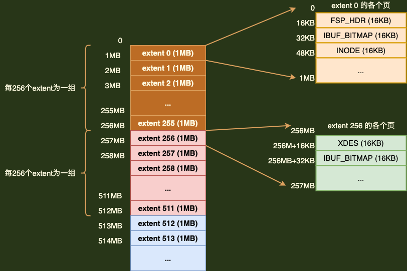
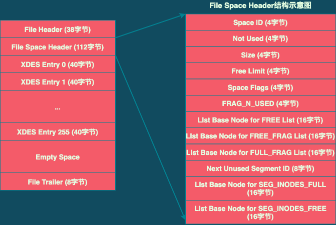

# InnoDB的独立表空间

> **资料: 《Mysql是怎样运行的》第9章**
>
> > **因为其中涉及的概念和结构有点多，所以在这里进行整理，也加深一下印象**


## 1. 数据页通用部分

> **InnoDB 是以页为单位管理存储空间的。如聚簇索引和其它二级索引都是以B+树的形式保存到表空间中，而B+树的节点就是类型名为`FIL_PAGE_INDEX`的数据页。**
>
> **InnoDB所有类型的页面都有如下的通用结构:**
>
>  
>
> > **所有类型的页面都包含两个部分: **
> >
> > + **File Header: 记录页面的一些通用信息**
> > + **File Trailer: 校验页是否完整，保证页面在从内存刷新到磁盘后内容是相同的**
>
> > **不同类型的页面在中间的 16338B 字节的内容是不同的。**


### 1.1 File Header的结构

> | 名称                             | 占用空间大小 | 描述                                                         |
> | -------------------------------- | :----------- | ------------------------------------------------------------ |
> | FIL_PAGE_SPACE_OR_CHKSUM         | 4字节        | 4.0.14版本后表示页的校验和                                   |
> | FIL_PAGE_OFFSET                  | 4字节        | 页号                                                         |
> | FIL_PAGE_PREV                    | 4字节        | 上一个页的页号                                               |
> | FIL_PAGE_NEXT                    | 4字节        | 下一个页的页号                                               |
> | FIL_PAGE_LSN                     | 8字节        | **`页面被最后修改时对应的LSN值`**                            |
> | FIL_PAGE_TYPE                    | 2字节        | 页类型                                                       |
> | FIL_PAGE_FILE_FLUSH_LSN          | 8字节        | 仅在系统表空间的第一个页中定义，代表文件<br />至少被刷新到了对应的LSN值 |
> | FIL_PAGE_ARCH_LOG_NO_OR_SPACE_ID | 4字节        | **`页属于哪个表空间`**                                       |


### 1.2 页面类型

> **File Header中的`FIL_PAGE_TYPE`字段值列表**

| 类型名                  | 十六进制值 | 描述                    |
| ----------------------- | ---------- | ----------------------- |
| FIL_PAGE_TYPE_ALLOCATED | 0x0        | 最新分配，还未使用      |
| FIL_PAGE_UNDO_LOG       | 0x0002     | undo日志页              |
| FIL_PAGE_INODE          | 0x0003     | 存储段的信息            |
| FIL_PAGE_IBUF_FREE_LIST | 0x0004     | Change Buffer 空闲列表  |
| FIL_PAGE_IBUF_BITMAP    | 0x0005     | Change Buffer的一些属性 |
| FIL_PAGE_TYPE_SYS       | 0x0006     | 存储一引起系统数据      |
| FIL_PAGE_TYPE_TRX_SYS   | 0x0007     | 事务系统数据            |
| FIL_PAGE_TYPE_FSP_HDR   | 0x0008     | 表空间头部信息          |
| FIL_PAGE_TYPE_XDES      | 0x0009     | 存储区的一些信息        |
| FIL_PAGE_TYPE_BLOB      | 0x000A     | 溢出页                  |
| FIL_PAGE_INDEX          | 0x45BF     | 索引页，也就是数据页    |


### 1.3 File Trailer

> **File Trailer 占用8字节，主要分为2个部分: **
>
> + **1. 前4个字节，代表页的校验和。这个部分和File Header中的校验和相对应。每当一个页面在内在中发生修改时，在刷新之前就要把页面的校验和算出来。因为File Header在页面的开头部分，所以File Header中的校验和会先被刷到磁盘；当完全写完后，校验和也会被写到页的尾部。如果页面刷新成功，则File Header和File Trailer中的校验和应该是一致的。如果两者不同，则表示刷盘时出错**
> + **2. 后4个字节代表页面被最后修改时对应的LSN的后4字节。正常情况下应该与File Header部分的FIL_PAGE_LSN的后4字节相同。也是用于校验页的完整性。**


## 2. 独立表空间结构

> **InnoDB支持许多种类型的表空间。主要介绍独立表空间和系统表空间的结构。它们的结构比较相似，但系统表空间额外包含了一些关于整个系统的信息，所以先介绍独立表空间的结构**

**独立表空间结构如下图: **

 


### 2.1 区(extent)

> ****

> **表中数据多时，会占用很多表空间的页。为了更好的管理这些页面，InnoDB引入了`区(extent)`的概念。对于16KB的页来说，`连续的64个页就是一个区`，也就是说一个区默认占用 1MB 空间大小。**
>
> **InnoDB数据存储在B+树，B+树数据都存储在索引页中。如果表中数据量很少，只需要将B+树每树的页使用`File Header中的FIL_PAGE_PREV 和 FIL_PAGE_NEXT字段构成双向链表即可`。但随着表中数据增多，B+树每层的页都会形成一个双向链表，如果以页为单位来分配存储空间，双向链表相信的两个页之间的物理位置可能离得很远。这样在扫描数据时会导致硬盘需要经常重新定位磁头位置，从而影响查询性能。**
>
> **系统表空间和独立表空间，都可以看成是由若干个连续的区组成的，`每256个区被划分成一组`**

> **每个组的前几个页面类型都是类似的。其中第一个组最特殊，它最开始的3个页面类型分别是`FSP_HDR`、`IBUF_BITMAP`、`INODE`。之后的每个组的前两个页面类型都是`XDES`、`IBUF_BITMAP`**

> + **FSP_HDR类型页: 用来登记整个表空间的一些整体属性以及本组所有的区(即 extent 0 ~ extent 255, 这256个区) 的属性。`整个表空间只有一个 FSP_HDR 类型的页面`**
> + **IBUF_BITMAP类型页: 用来存储关于 Change Buffer的一些信息**
> + **INODE类型页: 存储了许多 INODE Entry的数据结构，关于 INODE Entry，会在下面说明**
> + **XDES类型页: 全称`extent descriptor`，用来登记本组256个区的属性。FSP_HDR页和XDES页的结构类似，只是比XDES页多存储了一些表空间属性信息。**


### 2.2 段

> **`段是虚拟概念，但是对应INODE Entry结构。而区是实际概念，对应XDES Entry结构。`**

> **InnoDB存储数据时按照区为单位进行分配， 可以消除很多的随机I/O，从而提高查询效率。但一个问题是，B+树索引是分叶子节点和非叶子节点的，而数据全部存储在叶子节点上， 如果在存储数据时不进行区分，同样可能会导致很多的随机I/O。**
>
> **所以InnoDB中，将叶子节点和非叶子节点存储在不同的区中，又将这些不同区的集合称为`段`。存放叶子节点的区的集合算是一个段，存放非叶子节点的区的集合也算是一个段，`即: 一个索引会生成两个段，叶子节点为段和非叶子节点段`**

> **默认情况下，一个表只有一个聚簇索引，一个索引会生成两个段。而段是以区为单位申请存储空间的， 一个区默认占用1MB存储空间。所以，默认情况下一个只存放了几条记录的小表也需要2MB的存储空间么??? 以后每次添加一个索引都要多申请2MB的存储空间么???  这对于记录比较少的表来说太浪费了。 `造成这种问题的原因是一个区被整个分配给某一个段后，即使段的数据填不满区中所有的页面，剩下的页面也不能挪作他用。`**
>
> **所以为了解决`对于数据量较小的表太浪费存储空间`的情况，InnoDB又提出了`碎片(fragment)区`的概念，`在这一个碎片区中，并不是所有的页都是为了存储同一个段的数据而存在的`，碎片区中的页可以用于不同的目的，比如有些页属于段A，有些页属于段B，有些页甚至不属于任何段。**
>
> **碎片区直属于表空间，并不属于任何一个段。**
>
> **所以引入区、段、碎片区的概念后，为某个段分配存储空间的策略如下: **
>
> > + **在刚开始向表中插入数据时，段是从某个碎片区以单个页面为单位来分配存储空间的**
> > + **当某个段已经占用了32个碎片区页面之后，就会以完整的区为单位来分配存储空间（原先占用的碎片区并不会被复制到新申请的完整的区中）**


> **所以，段现在不能仅定义为某些区的集合，更精确的话，`段应该是某些零散的页面以及一些完整的区的集合`。**

> **除了索引的叶子节点段和非叶子节点段之外，InnoDB还有为存储一些特殊的数据而定义的段，如回滚段。**


### 2.3 区的分类 以及 XDES Entry结构

> **表空间是由若干个区组成的，这些区大致可分为4类: **
>
> > + **空闲的区: 现在还没有用到这个区中的任何页面，对应状态为`FREE`**
> > + **有剩余空闲页面的碎片区: 碎片区中还有可被分配的空间页面，对应状态为`FREE_FRAG`**
> > + **没有剩余空闲页面的碎片区: 碎片区中的所有页面都被分配使用，没有空闲页面，对应状态为`FULL_FRAG`**
> > + **附属于某个段的区: 被分配来专门存储某个段数据的区，对应状态为`FSEG`**
> >
> > > **需要强调的是: `处于FREE、FREE_FRAG和FULL_FRAG这3种状态的区都是独立的，直属于表空间；而处于 FSEG 状态的区是附属于某个段的`。**


> **为了方便管理这些区，InnoDB设计了`XDES Entry (Extent Descriptor Entry) 结构`**
>
> **每一个区都对应一个XDES Entry 结构。**
>
> **XDES Entry结构图如下: **
>
>  
>
> > 
> >
> > + **Segment ID: 每个段都有一个唯一的编号，用ID表示。Segment ID表示该区所在的段，前提是该区已经分配给某个段了**
> > + **List Node: 将若干个 XDES Entry 结构串成一个链表**
> > + **State: 区的状态，可选值为上面提到的 FREE、FREE_FRAG、FULL_FRAG、FSEG的其中一个**
> > + **Page State Bitmap: 16个字节， 128位。一个区默认有64个页，这128位被划分为64个部分，每个部分有2位，对应区中的一个页。2位中的第1位表示对应的页是否是空闲的，第二位还没有用到**


#### 2.3.1 XDES Entry链表

> **到现在为止，提出了区、段、碎片区、附属于段的区、XDES Entry结构。提出这些概念的目的是`减少随机I/O，但又不至于让数据量少的表浪费空间`。**
>
> **向表中插入数据本质上是向表中各个索引的叶子节点段、非叶子节点段插入数据。而不同的区有不同的状态。**
>
> **大概说明向某个段中插入数据时，申请新页面的过程: `段中数据较少时，首先查看表空间中是否有状态为FREE_FRAG的区。如果找到了，那么从该区中取一个零散页把数据写入进去；否则到表空间中申请一个状态为FREE的区，把该区的状态变为FREE_FRAG，然后从该新申请的区中取一个零散页把数据写入。之后，在不同的段使用零散页的时候都从该区中取，直到该区中没有空闲页面；然后该区的状态就变成了 FULL_FRAG。`**
>
> > **上面的过程引出的一个问题: 怎么知道表空间中哪些区的状态是FREE，哪些是FREE_FRAG，哪些是FULL_FRAG?**


> **答案是通过 XDES Entry中的 List Node 链表**
>
> **可以通过 List Node 中的指针做3件事: **
>
> > + **通过List Node把状态为FREE的区对应的XDES Entry结构连接成一个链表，即FREE链表**
> > + **通过List Node把状态为FREE_FRAG的区对应的XDES Entry结构连接成一个链表，即FREE_FRAG链表**
> > + **同样可以构建FULL_FRAG链表**
>
> **`这样，每当想查找一个FREE_FRAG状态的区时，就直接把FREE_FRAG链表的头节点拿出来，从这个节点对应的区中取一些零散页来插入数据。当这个节点对应的区中没有空闲的页面时，就修改它的State字段值，然后将其从FREE_FRAG链表中移到FULL_FRAG链表中。同理，如果FREE_FRAG链表中一个节点都没有，那么就直接从FREE链表中取一个节点移到FREE_FRAG链表，并修改State值即可。`**
>
> **`当段中的数据已经占满了32个零散的页后，就直接申请完整的区来插入数据了。`**


> **那怎么知道哪些区属于哪个段呢？ **
>
> **可以基于链表将状态为FSEG的区对应的XDES Entry结构加入到一个链表中。`但是， 由于不同的段不能共用同一个FSEG区， 每个段都需要有它独立的链表，所以可以根据段号(Segment ID)来建立链表。 `**
>
> **是不是 有多少个段就建多少链表??**
>
> **由于一个段中可以有多个区， 有的区是完全空闲的，有的区还有一些空闲页面可用，有的区已经没有空闲页面可用了。所以段中的链表需要细分，InnoDB中为每个段中的区对应的XDES Entry结构建立了3个链表: **
>
> > + **FREE链表: 需要与直属于表空间的FREE链表区别开，这里的FREE链表为附属于某个段的链表**
> > + **NOT_FULL链表**
> > + **FULL链表**
>
> **`2.2节提到了，每一个索引都对应两个段，每个段都维护上面3个链表`**


> **如下的表: **
>
> ```sql
> CREATE table t (
> 	c1 int not null aut_increment,
>   	c2 varchar(100),
>   	c3 varchar(100),
>   	primary key (c1),
>   	key idx_c2 (c2)
> ) ENGINE=InnoDB;
> ```
>
>**表t 共有两个索引: 主键索引 和 二级索引 idx_c2 。所以这个表共有4个段，每个段都会维护上述3个链表，共12个链表。再加上直属于表空间的3个链表， 所以整个表t的独立表空间共需要维护 15个链表。**


### 2.4 段的结构

> **段并不对应表空间中某一个连续的物理区域，而是一个逻辑上的概念，由若干个零散的页面以及一些完整的区组成。**
>
> **就像每个区都有对应的XDES Entry来记录这个区中的属性，InnoDB为每个段都定义了一个`INODE Entry结构`来记录段中的属性**
>
> **INODE Entry结构图如下: **
>
>  
>
> 
>
> > **Segment ID: 这个INODE Entry结构对应的段的编号ID**
> >
> > **NOT_FULL_N_USED: 在NOT_FULL链表中已经使用了多少个页面**
> >
> > **3个LIst Base Node: 分别为段的FREE链表、NOT_FULL链表、FULL链表定义了List Base Node，这样当想查找某个段的某个链表的头节点和尾节点时，可以直接到这个部分找到对应链表的List Base Node**
> >
> > **Magic Number: 用来标识这个INODE Entry是否已经被初始化(即把各个字段的值都填进去了)。如果这个数字的值是`97937874`，表明该INODE Entry已经初始化，否则没有被初始化**
> >
> > **Fragment Array Entry: 段是一些零散页面和一些完整的区的集合中，每个Fragment Array Entry结构都对应着一个零散的页面，这个结构一共4字节，表示一个零散页面的页号**


### 2.5 链表基节点 List Base Node

> **`注: 以前认为List Base Node只用于表示XDES Entry链表基节点。但是结合后面的FSP_HDR页面结构等，可以发现 List Base Node 不只可以表示XDES Entry链表基节点，还可以表示INODE Entry链表基节点。 因为List Base Node中不包含结构相关的信息，而是 "页号 + 偏移量" 的组合`**
>
> ****

> **前面介绍了一堆链表，但是怎么找到这些链表，或者说怎么找到某个链表的头节点为或者尾节点在表空间中的位置?? `InnoDB设计了一个名为 List Base Node (链表基节点) 的结构`。 这个结构中包含了链表的头节点和尾节点的指针以及这个链表中包含了多少个节点的信息。**
>
> **List Base Node结构: **
>
>  


> **上面介绍的每个链表都对应这么一个List Base Node结构，其中: **
>
> > + **List Length: 链表共有多少个节点**
> > + **First Node Page Number 和 First Node Offset: 链表头节点在表空间中的位置**
> > + **Last Node Page Number 和 Last Node Offset: 链表尾节点在表空间中的位置**
>
> **一般把某个链表对应的List Base Node结构放置在表空间中的固定位置(参考下面的说明)， 这样就可以很容易的定位某个链表了**


## 3. 各类型页面详细情况


### 3.1 FSP_HDR类型页面

> **FSP_HDR页面是独立表空间的第一个组的第一个页面，也就是整个表空间的第一个页面，`页号为0` 。它存储了表空间的一些整体属性以及第一个组内256个区对应的XDES Entry结构。**
>
> **FSP_HDR类型页结构: **
>
>  
>
> 
>
> > **FSP_HDR页面组成部分及含义: **
> >
> > | 名称              | 占用空间大小 | 描述                      |
> > | ----------------- | ------------ | ------------------------- |
> > | File Header       | 38字节       | 页的一些通用信息          |
> > | File Space Header | 112字节      | 表空间的一些整体属性信息  |
> > | XDES Entry        | 10240字节    | 本组256个区对应的属性信息 |
> > | Empty Space       | 5986字节     | 页结构填充，无实际意义    |
> > | File Trailer      | 8字节        | 检验和                    |


#### 3.1.1 File Space Header部分

> **用来存储表空间的一些整体属性。结构如下图: **
>
>  
>
> **各字段作用: **
>
> | 名称                                    | 占用空间(字节) | 描述                                                         |
> | --------------------------------------- | -------------- | ------------------------------------------------------------ |
> | Space ID                                | 4              | 表空间的ID                                                   |
> | Not Used                                | 4              | 未被使用，可忽略                                             |
> | Size                                    | 4              | 当前表空间拥有的页面数                                       |
> | FREE Limit                              | 4              | 尚未被初始化的最小页号，大于或等于这个页号<br />的区对应的XDES Entry结构都没有被加入FREE链表 |
> | Space Flags                             | 4              | 表空间的一些占用存储空间比较小的属性                         |
> | FRAG_N_USED                             | 4              | FREE_FRAG链表中已使用的页面数量                              |
> | List Base Node for FREE List            | 16             | FREE链表的基节点                                             |
> | List Base Node for FREE_FRAG List       | 16             | FREE_FRAG链表的基节点                                        |
> | List Base Node for FULL_FRAG List       | 16             | FULL_FRAG链表的基节点                                        |
> | Next Unused Segment ID                  | 8              | 当前表空间中下一个未被使用的Segment ID                       |
> | List Base Node for SEG_INODES_FULL List | 16             | SEG_INODES_FULL 链表的基节点                                 |
> | List Base Node for SEG_INODE_FREE List  | 16             | SEG_INODES_FREE 链表的基节点                                 |
>
> 
>
> > + **List Base Node for FREE List、List Base Node for FREE_FRAG List、List Base Node for FULL_FRAG List: `这3个字段，就是分别直属于表空间的FREE链表基节点、FREE_FRAG链表基节点、FULL_FRAG链表的基节点`。`这3个链表的基节点在表空间的位置是固定的，就是在表空间的第一个页面（即FSP_HDR类型的页面）的File Space Header部分`。 所以后面在定位这几个链表时就相当容易了。**
> >
> > + **FRAG_N_USED: FREE_FRAG链表中已经使用的页面数量**
> >
> > + **FREE Limit: 表空间对应着具体的磁盘文件。表空间在最初创建时会有一个默认的大小。而且磁盘文件一般都是自增长文件，也就是当该文件不够用时，会自己增大文件大小。这就带来了下面2个问题: **
> >
> >   + **最初创建表空间时，可以指定一个非常大的磁盘文件；接着需要对表空间完成一个初始化操作，包括为表空间中的区建立对应的XDES Entry结构、为各个段建立INODE Entry结构、建立各种链表等在内的各种操作。但是对于非常大的磁盘文件来说，实际上有绝大部分的空间都是空闲的。`可以选择把所有空闲区对应的XDES Entry结构加入到FREE链表，也可以选择只所一部分空闲区加入到FREE链表，等空闲链表中的XDES Entry结构对应的区不够例的时候，再把没有加入FREE链表的空闲区对应的XDES Entry结构加入到FREE链表`。**
> >   + **对于自增长的文件来说，可能在发生一次自增长时分配的磁盘空间非常大。同样，可以选择把新分配的这些磁盘空间代表的空闲区对应的XDES Entry结构加入到FREE链表；也可以选择只把一部分空闲区加入到FREE链表，等空闲链表中的XDES Entry结构对应的区不够使的时候，再把之前没有加入FREE链表的空闲区对应的XDES Entry结构加入到FREE链表。 `InnoDB 中采用的就是后者，中心思想就是等用的时候再把它们加入到FREE链表。所以定义了 FREE Limit字段，在该字段表示的页号之后的区都未被使用，而且尚未被加入到FREE链表。`**
> >
> > + **Next Unused Segment ID: 表中每个索引对应两个段，每个段都有一个唯一的ID。当为某个表新创建一个索引的时候，意味着需要创建两个新的段。那怎么为这个新创建的段分配一个唯一的ID呢？ 肯定不可能去遍历现在表空间中所有的段，InnoDB设计了这个"Next Unused Segment ID"字段， `该字段表明当前表空间中最大的段ID的下一个ID`。这样在创建新段时为其赋予一个唯一的ID值时，`就可以直接使用这个字段的值，然后把该字段的值递增一下即可`。**
> >
> > + **Space Flags: 表空间中与一些布尔类型相关的属性，或者只需要几个比特就可表示的属性。**
> >
> >   > | 标志名        | 占用空间(比特) | 描述                                           |
> >   > | ------------- | -------------- | ---------------------------------------------- |
> >   > | POST_ANTELOPE | 1              | 文件格式是否在ANTELOPE格式之后                 |
> >   > | ZIP_SSIZE     | 4              | 压缩页面的大小                                 |
> >   > | ATOMIC_BLOBS  | 1              | 是否自动把占用存储空间非常多的字段放到溢出页中 |
> >   > | PAGE_SSIZE    | 4              | 页面大小                                       |
> >   > | DATA_DIR      | 1              | 表空间是否是从数据目录中获取的                 |
> >   > | SHARED        | 1              | 是否为共享表空间                               |
> >   > | TEMPORARY     | 1              | 是否为临时表空间                               |
> >   > | ENCRYPTION    | 1              | 表空间是否加密                                 |
> >   > | UNUSED        | 18             | 未用到                                         |
> >
> > + **List Base Node for SEG_INODES_FULL List 和 List Base Node for SEG_INODES_FREE List: `参考2.5节，List Base Node可以用来表示INODE Entry结构链表基节点，所以可以用在这里。` 每个段对应的INODE Entry结构会集中存放到一个类型为INODE的页中，。如果表空间中的段特别多，则会有多个INODE Entry结构，此时可能一个页放不下，就需要多个INODE类型的页面。这些INODE类型的页会构成下面两种链表: **
> >
> >   + **SEG_INODES_FULL链表: INODE类型的页面都已经被INODE Entry结构填满，没有空间空间存放额外的INODE Entry**
> >   + **SEG_INODES_FREE链表: 该链表中的INODE页面中有空闲的空间来存储INODE Entry结构**


#### 3.1.2 XDES Entry部分

> **紧跟着File Space Header部分的就是XDES Entry部分了。 一个XDES Entry结构的大小是40字节，`由于一个页面大小有限，只能存放数量有限的XDES Entry结构，所以才把256个区划分成一组`，在每组的第一个页面中存放256个XDES Entry结构。**


### 3.2 XDES类型页

> **前面说过， 每个XDES Entry结构对应表空间的一个区。虽然一个XDES Entry结构只占用40字节，但是抵不住表空间中区的数据不断增多。 `在区的数量非常多时，一个单独的页可能无法存放足够多的XDES Entry结构。所以把表空间的区分为若干个组，每组开头的一个页面记录着本组内所有的区对应的XDES Entry结构`。**
>
> **`由于第一个组的第一个页面有些特殊，所以除了记录本组中所有区对应的XDES Entry结构外，还记录着表空间的一些整体属性，这个页面类型就是 FSP_HDR 类型， 整个表空间里只有一个这种类型的页面。`**
>
> **`除第一个分组以外，之后每个分组的第一个页面只需要记录本组内所有的区对应的XDES Entry结构即可，不需要再记录表空间的属性。为了与FSP_HDR类型进行区别，把之后每个分组中第一个页面的类型定义为XDES。`**
>
> **XDES类型页面结构和FSP_HDR类型页面结构类似，如下图: **
>
>  
>
> 
>
> > **与FSP_HDR类型的页面对比，XDES类型的页面除了没有File Space Header部分之外（也就是除了没有记录表空间整体属性的部分之外），其余的部分是一样的。**


### 3.3 IBUF_BITMAP类型页

> **每个分组中第二个页面的类型都是IBUF_BITMAP。这种类型的页中记录了一些有关Change Buffer的信息。**
>
> **平时说向表中插入一条记录，配制上是向每个索引对应的B+树中插入记录。该记录首先插入聚簇索引页面，然后再插入每个二级索引页面。这些页面在表空间中随机分布，将会产生大量的随机I/O，严重影响性能。对于UPDATE和DELETE操作来说，也会带来许多的随机I/O。`所以InnoDB中引入了一种 Change Buffer结构，Change Buffer本质上也是表空间中的一颗B+树，它的根节点存储在系统表空间中。`**
>
> **修改非唯一二级索引页面时（修改唯一二级索引页面时是否利用Change Buffer取决于很多情况，这里不展开讨论），如果该页面尚未被加载到内在中（仍在磁盘上），那么`该修改将先被暂时缓存到Change Buffer中，之后服务器空闲或者其他什么原因导致对应的页面从磁盘上加载到内在中时，再将修改合并到对应页面`。**


### 3.4 INODE 类型页

> **参考3.1节，表空间第一个分组中第三个页面的类型是INODE。前面讲过，InnoDB中为每个索引定义了两个段，而且为某些特殊功能定义了特殊的段。为了方便管理这些段，InnoDB 为每个段定义了一个INODE Entry结构，来记录这个段的相关属性。 **

> **INODE类型的页就是为了存储INODE Entry结构而存在的，结构如下图: **
>
>  
>
> 
>
> > **INODE类型页面字段及描述:**
> >
> > | 名称                          | 占用空间(字节) | 描述                                       |
> > | ----------------------------- | -------------- | ------------------------------------------ |
> > | File Header                   | 38             | 页通用信息                                 |
> > | List Node for INODE Page List | 12             | 存储上一个INODE页面和下一个INODE页面的指针 |
> > | INODE Entry                   | 16320          | 具体的INODE Entry结构                      |
> > | Empty Space                   | 6              | 页结构填充，没有实际意义                   |
> > | File Trailer                  | 8              | 校验和                                     |
>
> 
>
> > **File Header、Empty Space、File Trailer在前面的FSP_HDR和XDES类型页中也有，跳过它们。重点关注 List Node for INODE Page List 和 INODE Entry 这两个部分**


#### 3.4.1 INode Entry部分

> **关于INODE Entry结构，参考2.4节。 INODE Entry部分最多可以存储85个INODE Entry结构，每个INODE Entry结构占用192字节， 所以INODE页面中的INODE Entry部分共16320字节。**


#### 3.4.2 List Node for INODE Page List部分

> **如果一个表空间中存在的段超过了85个，那么一个INODE类型的页面不足以存储所有的段对就的INODE Entry结构，所以就需要额外的INODE类型页面来存储这些结构。**
>
> **为了方便管理这些INODE类型的页面，InnoDB将这些INODE类型的页面串连成两个不同的链表，参考3.1.1节: **
>
> > + **SEG_INODES_FULL链表: 这个链表中的INODE页面中已经没有空闲空间来存储INODE_Entry结构**
> > + **SEG_INODES_FREE链表: 这个链表中的INODE页面还有空闲空间来存储额外的INODE Entry结构**


> **在3.1.1节占， `SEG_INODES_FULL、SEG_INODES_FREE 这两个链表的基节点就存储在FSP_HDR类型页面的File Space Header中`。也就是说这两个链表的基节点的位置是固定的，从而可以轻松访问这两个链表。 **
>
> **每当新创建一个段（创建索引就会创建段）时，都会创建与之对应的INODE Entry结构。存储INODE Entry的过程大致如下: **
>
> > + **1. 先检查SEG_INODES_FREE链表是否为空。如果不为空，直接从该链表中获取一个节点，也就相当于获取到一个仍有空闲空闲的INODE类型的页面，然后把该INODE Entry结构放到该页面中。当该页面中无剩余空间时，就把该页放到SEG_INODES_FULL链表中**
> >
> > + **2. `如果SEG_INODES_FREE链表为空，则需要从表空间的FREE_FRAG链表中申请一个页面，并将该页面的类型修改为INODE，把该页面放到SEG_INODES_FREE链表中；同时把该INODE Entry结构放入该页面`**
> >
> >   > ***`注: 前面一直认为表空间的FREE_FRAG链表中的页只可能用来存储数据，没想到还能用来作为INODE page`***


## 4. Segment Header结构的运用

> **一个索引会产生两个段，分别是叶子节点为段和非叶子节点段，而每个段都对应一个INODE Entry结构。 **
>
> **那么怎么知道某个段对应哪个INODE Entry结构?? **
>
> **所以得将这种对应关系记在某个地方，`而这个地方就是 数据页（即INDEX类型页）中的 Page Header部分中的字段`。**
>
> > ***参考《3. InnoDB数据页结构.md》***
>
> > | 名称              | 占用空间(字节) | 描述                                               |
> > | ----------------- | -------------- | -------------------------------------------------- |
> > | PAGE_BTR_SEG_LEAF | 10             | B+树叶子节点段的头部信息，仅在B+树的根页中定义     |
> > | PAGE_BTR_SEG_TOP  | 10             | B+树非叶子节点为段的头部信息，仅在B+树的根页中定义 |


> **PAGE_BTR_SEG_LEAF 和 PAGe_BTR_SEG_TOP 其实对应一个名为 Segment Header的结构: **
>
>  
>
> 
>
> > **Segment Header结构各个部分的具体含义: **
> >
> > | 名称                           | 占用空间(字节) | 描述                            |
> > | ------------------------------ | -------------- | ------------------------------- |
> > | Space ID of the INODE Entry    | 4              | INODE Entry结构所在的表空间ID   |
> > | Page Number of the INODE Entry | 4              | INODE Entry结构所在的页面页号   |
> > | Byte Offset of the INODE Entry | 2              | INODE Entry结构在该页中的偏移量 |
>
> **所以，`PAGE_BTR_SEG_LEAF记录着叶子节点段对应的INODE Entry结构的地址是哪个表空间中哪个页面的哪个偏移量； PAGE_BTR_SEG_TOP记录着非叶子节点段对应的INODE Entry结构的地址是哪个表空间中哪个页面的哪个偏移量。`**
>
> **需要注意的一点是，因为一个索引只对应两个段，所以只需要在索引的根页面中记录这两个结构即可**
>
> ***`这样就可以读取索引文件的头部信息，就能获取到它对应的两个段的表空间和页号位置`***


