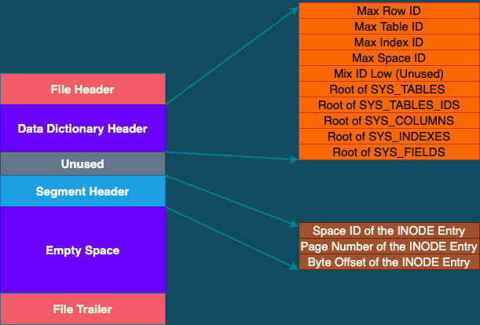

# InnoDB的系统表空间

> **系统表空间的结构和独立表空间的类似，参考《5. InnoDB的独立表空间.md》，只是由于MySQL进程只有一个系统表空间，系统表空间中需要记录一些与整个系统相关的信息，所以会比独立表空间多出一些用来记录这些信息的页面。**
>
> **因为系统表空间很重要，相当于所有表空间的"带头大哥"，所以它的表空间ID （Space ID）是0**


## 1. 整体结构

 


> **系统表空间和独立表空间的前3个页面（0~2）的类型是一致的，但是页号为 3～7 的页面是系统表空间特有的。**
>
> | 页号 | 页面类型                    | 描述                        |
> | ---- | --------------------------- | --------------------------- |
> | 3    | SYS: Insert Buffer Header   | 存储Change Buffer的头部信息 |
> | 4    | INDEX: insert buffer root   | 存储Change Buffer的根页面   |
> | 5    | TRX_SYS                     | 事务系统的相关信息          |
> | 6    | SYS: First rollback segment | 第一个回滚段的信息          |
> | 7    | SYS: Data Directory Header  | 数据字典头部信息            |
>
> > **`除了这几个记录系统属性的页面之外，系统表空间的 extent 1 和 extent 2 这两个区，也就是页号从 64~191 的这128个页面称为 Doublewrite Buffer （双写缓冲区）。`**


## 2. InnoDB 数据字典

> **MySQL除了保存用户插入的数据之外，还需要保存许多额外的信息，也称为`元数据`，如: **
>
> + **某个表属于哪个表空间，表里面有多少列**
> + **表对应的每一个列的类型是什么**
> + **该表有多少个索引，每个索引对应哪几个字段，该索引对应的根页在哪个表空间的哪个页面**
> + **该表有哪些外键，外键对应哪个表的哪些列**
> + **某个表空间对应的文件系统上的文件路径是什么**


> **InnoDB定义了一系列内部系统表来记录这些元数据: **
>
> | 表名             | 描述                                   |
> | ---------------- | -------------------------------------- |
> | SYS_TABLES       | 整个InnoDB存储引擎中所有表的信息       |
> | SYS_COLUMNS      | 整个InnoDB存储引擎中所有列的信息       |
> | SYS_INDEXES      | 所有索引信息                           |
> | SYS_FIELDS       | 所有索引对应的列的信息                 |
> | SYS_FOREIGN      | 所有外键的信息                         |
> | SYS_FOREIGN_COLS | 所有外键对应列的信息                   |
> | SYS_TABLESPACES  | 所有表空间的信息                       |
> | SYS_DATAFILES    | 所有表空间对应的文件系统的文件路径信息 |
> | SYS_VIRTUAL      | 所有虚拟生成的列的信息                 |


> **这些表中，SYS_TABLES、SYS_COLUMNS、SYS__INDEXES、SYS_FIELDS 这4个表称为 基本系统表**


### 2.1 SYS_TABLES表

| 列名       | 描述                                           |
| ---------- | ---------------------------------------------- |
| NAME       | 表名                                           |
| ID         | InnoDB引擎中每个表都有的一个唯一的ID           |
| N_COLS     | 表拥有的列的个数                               |
| TYPE       | 表类型，记录了一些文件格式、行格式、压缩等信息 |
| MIX_ID     | 已过时                                         |
| MIX_LEN    | 表的一些额外属性                               |
| CLUSTER_ID | 未使用                                         |
| SPACE      | 表所属表空间的ID                               |


### 2.2 SYS_COLUMNS表

| 列名     | 描述                                                         |
| -------- | ------------------------------------------------------------ |
| TABLE_ID | 列所属表对应的ID                                             |
| POS      | 该列在表中是第几列                                           |
| NAME     | 列的名称                                                     |
| MTYPE    | 主数据类型，即INT、CHAR等类型                                |
| PRTYPE   | 精确数据类型，即是否允许NULL值，是否允许负数等修饰主数据类型的定义 |
| LEN      | 该列最多占用存储空间的字节数                                 |
| PREC     | 列的精度，未使用                                             |


### 2.3 SYS_INDEXES表

| 列名            | 描述                                                         |
| --------------- | ------------------------------------------------------------ |
| TABLE_ID        | 表ID                                                         |
| ID              | 索引ID                                                       |
| NAME            | 索引名                                                       |
| N_FIELDS        | 索引包含的列的个数                                           |
| TYPE            | 索引类型，如聚簇索引、唯一二级索引等                         |
| SPACE           | 索引根页面所在的表空间ID                                     |
| PAGE_NO         | 索引根页面所在的页面号                                       |
| MERGE_THRESHOLD | 如果页面中的记录被删除到某个比例，就尝试把该页面和相邻页面合并，这个值就是那个比例 |


### 2.4 SYS_FIELDS表

| 列名     | 描述                 |
| -------- | -------------------- |
| INDEX_ID | 列所属索引的ID       |
| POS      | 列在索引列中是第几列 |
| COL_NAME | 列的名称             |


## 3. Data Dictionary Header页面

> **`有了上述4个基本系统表，也就意味着可以获取其它系统表以及用户定义的表的所有元数据。`**
>
> **例如: 想看一下SYS_TABLESPACES系统表中存储了哪些表空间以及表空间对应的属性，可以执行下述操作**
>
> + **根据表名到SYS_TABLES表中定位到具体记录，从而获取到SYS_TABLESPACES表的TABLE_ID**
> + **使用TABLE_ID到SYS_COLUMNS表中可以获取到属于该表的所有列的信息**
> + **使用TABLE_ID还可以到SYS_INDEXES表中获取所有的索引的信息。索引的信息包括对应的INDE_ID，还记录着该索引对应的B+树根页面是哪个表空间的哪个页面**
> + **使用获取到的INDEX_ID就可以到SYS_FIELDS表中获取所有索引列的信息**


> **即上面说的4个表最基本的表，`那么这4个表的元数据去哪里获取呢? 只能把这4个表的元数据（也就是它们有哪些列、哪些索引等信息）硬编码到代码中。`**
>
> **`具体到InnoDB中，它将这4个表的聚簇索引和二级索引对应的B+树位置记录到了页号为7的页面，类型为SYS，记录了Data Dictionary Header（数据字典的头部信息）。除了这4个表的5个索引的根页面信息外，这个页号为7的页面还记录了整个InnoDB存储引擎的一些全局属性。`**
>
> **如下图: **
>
>  
>
> **说明:**
>
> | 名称                   | 占用空间(字节) | 简单描述                                                     |
> | ---------------------- | -------------- | ------------------------------------------------------------ |
> | File Header            | 38             | 页的通用信息                                                 |
> | Data Dictionary Header | 52             | 记录一些基本系统表的根页面位置以及InnoDB存储引擎的一些全局信息 |
> | Unused                 | 4              | 未使用                                                       |
> | Segment Header         | 10             | 记录本页面所在段对应的INODE Entry位置信息                    |
> | Empty Space            | 16272          | 页结构填充，无实际意义                                       |
> | File Trailer           | 8              | 校验页是否完整                                               |
>
> > **`这个页面有 Segment Header部分（参考《5. InnoDB的独立表空间.md》），这意味着InnoDB把这些数据字典的信息当成一个段来分配存储空间，可以称之为数据字典段。由于目前需要记录的数据字典信息非常少（可以看到Data Dictionary Header部分仅占用52字节），所以该段只有一个碎片页，也就是页号为7的这个页。`**


### 3.1 Data Dictionary Header部分的各个字段

+ **Max Row ID: 在不显式地为表定义主键，而且表中也没有不允许NULL值的UNIQUE键的情况下，InnoDB会默认生成一个名为 row_id 的列作为主键。因为它是主键，所以每条记录的 row_id 值不能重复。原则上主要一个表中的 row_id列不重复就可以了，也就是说表a和表b拥有一样的 row_id 列也没啥关系。但InnoDB提供了这个 Max Row ID字段，无论哪个拥有 row_id 列的表插入一条记录，该记录的 row_id列值就是 Max Row ID对应的值，然后再把 Max Row ID对应的值加1，`即 Max Row ID是全局共享的`**
+ **Max Table ID: InnoDB中，所有的表都对应一个唯一的ID，每次新那家一个表时，就会把该字段的值加1，然后将其作为该表的ID**
+ **Max Index ID: 每次用 Max Index ID加1，结果作为新索引对应的ID**
+ **Max Space ID: 表空间ID**
+ **Mix ID Low: 没用，跳过**
+ **Root of SYS_TABLES cluster index: SYS_TABLES表聚簇索引的根页面的页号**
+ **Root of SYS_TABLE_IDS sec index: 表示SYS_TABLES表为ID列建立的二级索引的根页面的页号**
+ **Root of SYS_COLUMNS cluster index: 同上**
+ **Root of SYS_INDEXES cluster index: 同上**
+ **Root of SYS_FIELDS cluster index: 同上**


### 3.2 information_schema 系统数据库

> **需要注意，用户不能直接访问InnoDB的这些内部系统表，除非直接去解析系统表空间对应的文件系统上的文件。不过InnoDB提供了系统数据库 information_schema，可以获取一些以INNODB_SYS开头的表信息。 **
>
> **示例: **
>
> ```mysql
> mysql> use information_schema;
> Reading table information for completion of table and column names
> You can turn off this feature to get a quicker startup with -A
> 
> Database changed
> 
> mysql> SHOW TABLES LIKE 'INNODB_SYS%';
> +--------------------------------------------+
> | Tables_in_information_schema (INNODB_SYS%) |
> +--------------------------------------------+
> | INNODB_SYS_DATAFILES                       |
> | INNODB_SYS_VIRTUAL                         |
> | INNODB_SYS_INDEXES                         |
> | INNODB_SYS_TABLES                          |
> | INNODB_SYS_FIELDS                          |
> | INNODB_SYS_TABLESPACES                     |
> | INNODB_SYS_FOREIGN_COLS                    |
> | INNODB_SYS_COLUMNS                         |
> | INNODB_SYS_FOREIGN                         |
> | INNODB_SYS_TABLESTATS                      |
> +--------------------------------------------+
> 10 rows in set (0.00 sec)
> ```
>
> 