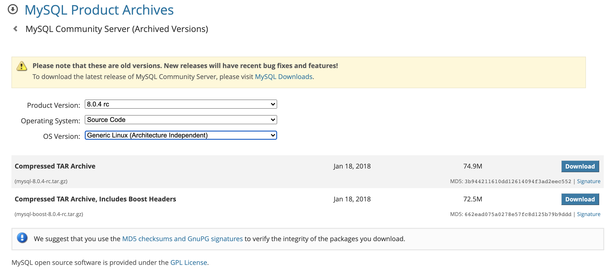
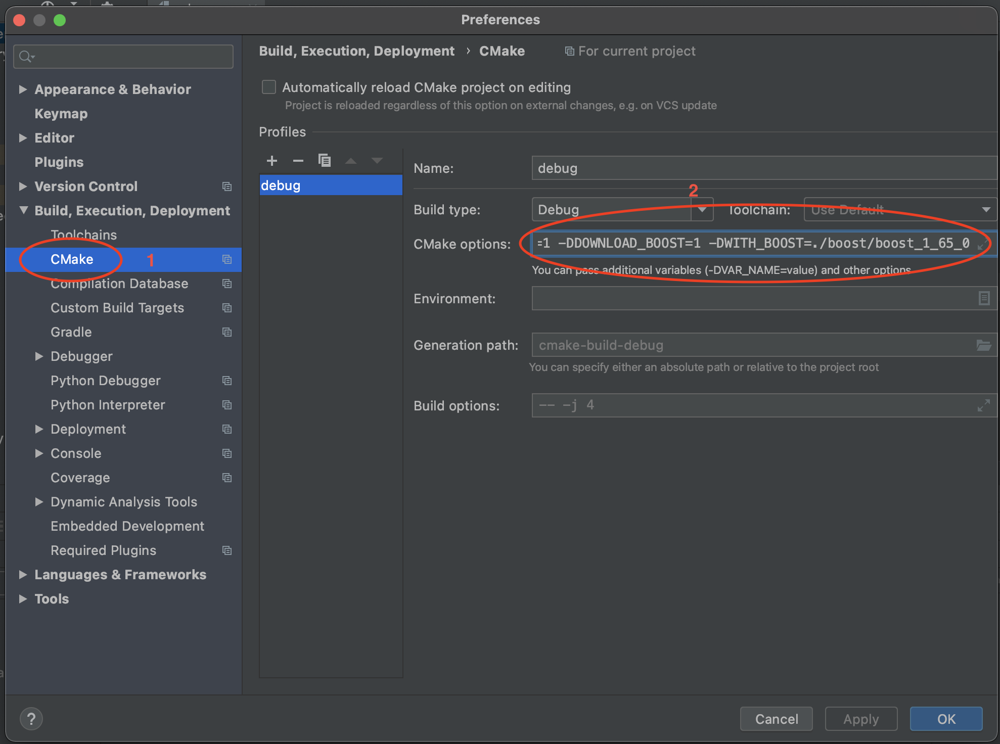
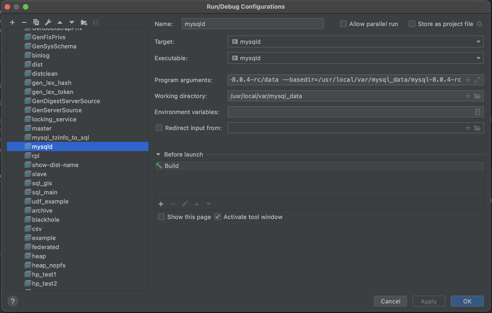

#### 参考网址

> https://www.jianshu.com/p/644aea290c6b
>
> https://blog.csdn.net/d6619309/article/details/75201876


### 工具

- CLIon：
  [官网下载地址](https://www.jetbrains.com/clion/download/#section=mac)
  送佛送到西，[注册码](http://idea.lanyus.com/)
- Mysql源码
  [官网下载地址](https://dev.mysql.com/downloads/mysql/) ,选择源码下载即可
- boost 下载
  从源码中可以看到，是需要1.65.0 下载对应的[boost](https://www.boost.org/users/history/)

> 注：在下载地址上有自带boost的源码包, 本人直接下载的那个;
>
> **网址: https://downloads.mysql.com/archives/community/**
>
> 


### 准备工作

- 确定MySQL源码目录：~/Documents/mysql-8.0.4-rc
- 确定MySQL编译工作目录[basedir]：/usr/local/var/mysql_data/mysql-8.0.4-rc
- 确定MySQL编译后的数据目录[datadir]：/usr/local/var/mysql_data/mysql-8.0.4-rc/data

> **注：在 /usr/local/var/ 目录下原本就包含一个mysql目录, 那个目录是通过 `brew install mysql@5.7` 命令安装时自动生成的, 不要修改那个目录;**


### 搭建

- 编译MySQL

```shell
// 第一步 进入源码目录
cd ~/Documents/mysql-8.0.4-rc

// 第二步 cmake
cmake \
-DCMAKE_INSTALL_PREFIX=/usr/local/var/mysql_data/mysql-8.0.4-rc \
-DMYSQL_DATADIR=/usr/local/var/mysql_data/mysql-8.0.4-rc/data \
-DSYSCONFDIR=/usr/local/var/mysql_data/mysql-8.0.4-rc \
-DMYSQL_UNIX_ADDR=/usr/local/var/mysql_data/mysql-8.0.4-rc/data/mysql.sock \
-DWITH_DEBUG=1  \
-DDOWNLOAD_BOOST=1 -DWITH_BOOST=./boost/boost_1_65_0

// 第三步 make
make -j 4

// 第四步 安装
make install -j 4

// 第五步 初始化数据库
cd /usr/local/var/mysql_data/mysql-8.0.4-rc

./mysqld --basedir=/usr/local/var/mysql_data/mysql-8.0.4-rc --datadir=/usr/local/var/mysql_data/mysql-8.0.4-rc/data --initialize-insecure --user=gwwwwt
```


### clion 配置

- 导入mysql源码项目

  选择路径:/Users/shiyibo/Sc/mysql-8.0.4-rc, 导入后，clion会默认用系统自动的makefile文件make一遍，如果系统自带的boost不是1.65.0的话，会有报错，不用处理，接下来cmake配置后，不会有这问题；

- cmake 配置
   clion -> Preferences -> Build,Execution,Deployment -> CMake

  

```jsx
// 1 设置Name, 直接使用默认的debug就行
// 2 BuildType: 设置为Debug
// 3 Cmake Option 设置为：
-DCMAKE_INSTALL_PREFIX=/usr/local/var/mysql_data/mysql-8.0.4-rc \ -DMYSQL_DATADIR=/usr/local/var/mysql_data/mysql-8.0.4-rc/data \ -DSYSCONFDIR=/usr/local/var/mysql_data/mysql-8.0.4-rc \ -DMYSQL_UNIX_ADDR=/usr/local/var/mysql_data/mysql-8.0.4-rc/data/mysql.sock \
-DWITH_DEBUG=1  \
-DDOWNLOAD_BOOST=1 \
-DWITH_BOOST=./boost/boost_1_65_0
```


- 配置mysqld

点击Edit Configurations.... , **找到mysqld(注意, 不是mysql)**




```jsx
// 1 中的Target和Executable 都选择mysqld
// 2 中写一个Name, 直接就是默认的mysqld即可
// 3 中写的是
--basedir=/usr/local/var/mysql_data/mysql-8.0.4-rc
--datadir=/usr/local/var/mysql_data/mysql-8.0.4-rc/data
// 4 Working directory 中是MySQL编译后的Home路径 
```

- 至此，该配置的就配置好了，点击debug，就可以启动MySQL


### 调试

```cpp
// 找到sql/sql_parse.cc 的do_command函数, 设置断点
// 登录MySQL，需要进入/usr/local/var/mysql_data/mysql-8.0.4-rc/bin下面执行, 直接enter回车即可,
// root初始化密码为空密码
mysql -uroot -h127.0.0.1 -P3306 -p
// 程序就可以正常运行到断点处，接下来，就可以继续研究了
```